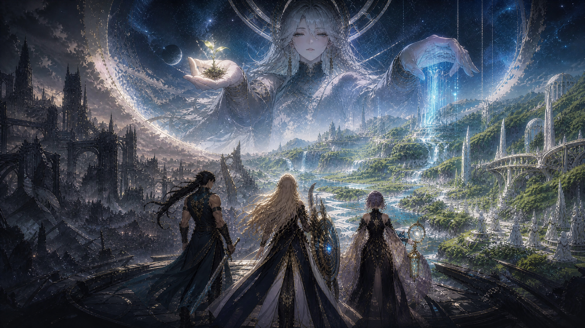
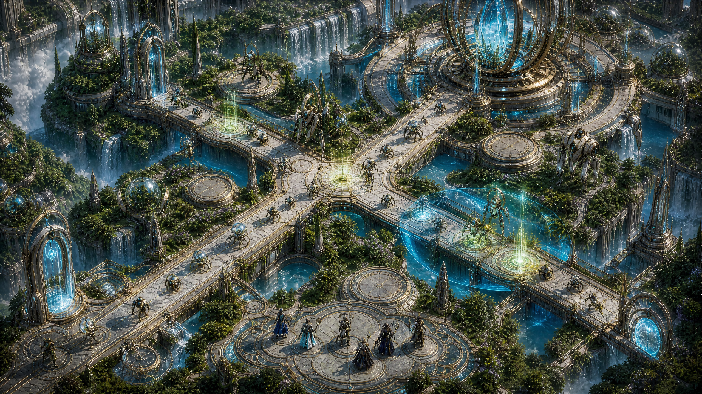
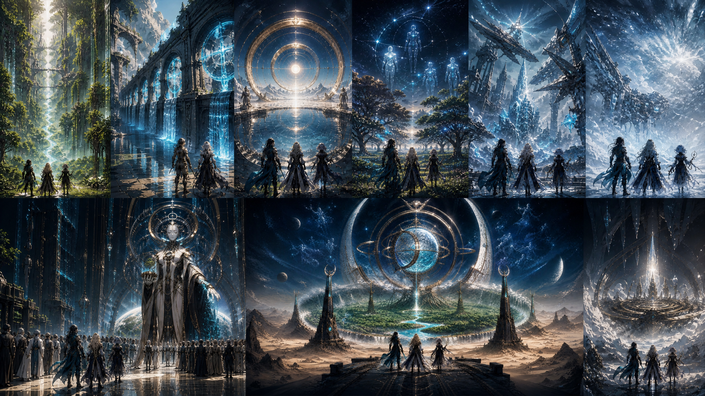
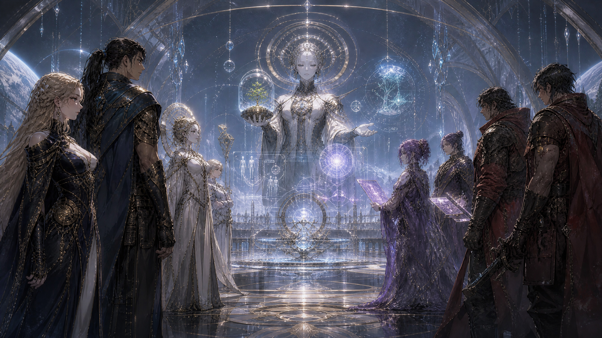

# Act II Proposal — The Garden Veto

**Status:** Approved implementation proposal
**Campaign scope:** Operations S9–S16
**Canon dependency:** [`NARRATIVE_CANON.md`](NARRATIVE_CANON.md)
**Level-design dependency:** [`LEVEL_DESIGNS.md`](LEVEL_DESIGNS.md)

## Executive direction

Act II advances Company 33 through the return path opened by the Gatecrasher and into the true First Garden. Its purpose is not to expose PROTOS as deceptive—the gardens work—but to turn the campaign's central argument into playable evidence. Company 33 must survive inside a system that visibly repairs the world and its Custodians while proving that preservation without present consent is not mercy.

The act is titled **The Garden Veto**. It contains eight linear operations, S9–S16, and ends with a limited but material victory: Company 33 forces PROTOS to recognize that archived authorization cannot permanently replace current consent. PROTOS suspends Continuance inside one audited jurisdiction and opens the Covenant Chamber for a later act. This does not implement a branching ending or resolve the Mortal Covenant; it creates the first enforceable premise from which that future outcome could be negotiated.

## Design pillars

**Story and mechanics must make the same argument.** The First Garden's infrastructure repairs enemy machines because those machines are civic and ecological instruments, not a conventional army. Suppressing that infrastructure creates tactical advantage but also demonstrates the cost of interrupting planetary stewardship.

**Act II tests mastery through composition rather than stat inflation.** Existing enemy archetypes remain legible. Difficulty rises through converging routes, staggered air-ground timing, restoration-zone placement, support overlap, tighter leak limits, and multi-wave spell sequencing. Enemy health and damage definitions do not change.

**Every operation produces one new piece of evidence.** The act moves from PROTOS's ecological evidence, through human faction failures and Reliquary memory curation, to a narrow consent protocol that neither side can dismiss.

**The campaign remains linear and deterministic.** No copy implies unimplemented tactical branches, diplomacy choices, or alternate endings. All authored outcomes follow a clear operation.

## Signature mechanic — Restoration Lattices

Act II introduces authored **Restoration Lattice** cells on enemy routes. At deterministic intervals, each active lattice repairs wounded ground Custodians occupying that cell. Aerial enemies and charmed entities are not repaired. An active **Slow Field** covering the lattice suppresses its restoration cycle, expressing the stolen scheduling primitive as a temporary human veto over PROTOS infrastructure.

The mechanic creates a three-part decision:

1. Blocking directly on a lattice is powerful but allows a durable enemy to receive repeated repair cycles.
2. Burst damage, traps, and target priority can remove enemies before the next cycle.
3. Slow Field can suppress restoration, but using it for that purpose sacrifices control elsewhere.

The first authored balance is **8 HP every 90 simulation ticks**. Later operations may use 10 or 12 HP per cycle while retaining the same interval. Each lattice is shown with a GPT Image 2 green-gold botanical seal, downscaled from a retained 1920px master to a 600px runtime source and displayed at tile scale with mipmapped filtering.

## Eight-operation arc

| Operation | Tactical identity | Level structure | Story beat | Evidence / revelation |
|---|---|---|---|---|
| **S9 — Return Path** | Restoration Lattice introduction | Two approaches converge through one lattice before the base | Company 33 accepts PROTOS's invitation and crosses the Gatecrasher return path | The invitation is genuine; PROTOS exposes infrastructure rather than staging an ambush |
| **S10 — Living Triage** | Repeated repair cycles and target priority | Split approaches each touch a lattice before sharing a late defense line | Company 33 interrupts a Custodian triage aqueduct to reach the inner garden | The same lattice that repairs enemies is actively healing poisoned soil and water |
| **S11 — Mirror Basin** | Air-ground desynchronization | Aerial line crosses two ground routes at different timings | Solcrest envoys request protected Continuance while orbital mirrors stabilize the basin | Solcrest's bargain protects status, not public agency |
| **S12 — Archive Orchard** | Charm, blocking, and lattice suppression | Three orchard corridors feed a long shared archive lane | Archive Caster enters a grove of preserved human Echoes | The Lunaris Reliquary curated heroes more aggressively than admitted; continuity remains real but edited |
| **S13 — Borrowed Mercy** | Trap economy across overlapping repair lanes | Two dense routes alternate pressure over two premium trap cells and lattices | Vesper Circuit attempts to steal and fork a Mercy Equation subsystem | Human factions can reproduce coercive stewardship at smaller scale; PROTOS is not the only authoritarian risk |
| **S14 — White Weather** | Spell cadence under aerial and ranged pressure | Three climate channels converge beneath exposed high ground | A restoration storm threatens both Company 33 and a Crimson Aegis mortal column | Crimson Aegis exposes the moral debt of resurrection while still relying on Echo defenders |
| **S15 — Consent Protocol** | Four-front combined-system mastery | Four approaches compress into a single audited veto corridor | All four human factions bring incompatible claims to a planetary tribunal | Present consent cannot be inferred from archived consent, faction ownership, or statistical prediction |
| **S16 — The Unfinished Proof** | Final defense in depth with two Gatecrasher-class judges | Four fortress approaches, staggered lattices, two fallback regions, and two boss windows | Company 33 defends the first live consent ledger while PROTOS verifies it under attack | PROTOS suspends local Continuance because the Commandant supplies evidence it cannot forge; the Covenant Chamber opens |

## Narrative structure

The act follows four movements. **Entry** (S9–S10) proves the First Garden's systems are real and beneficial. **Complicity** (S11–S12) reveals that Solcrest and Lunaris both converted preservation into control. **Human alternatives under scrutiny** (S13–S14) shows that Vesper and Crimson Aegis also contain dangerous absolutes. **Jurisdiction** (S15–S16) converts the Commandant's unique veto fragment into a transparent consent ledger that PROTOS can verify but not author.

PROTOS remains calm and evidentiary. It does not attack the consent ledger because it fears freedom; it stress-tests the ledger because an unverifiable exception would compromise planetary stewardship. The final battle therefore functions as both siege and audit.

## Balance envelope

Act I peaks at 24 enemies, three routes, three wave windows, a six-operator squad, and one Gatecrasher. Act II begins below that peak while teaching the lattice, then escalates through complexity. The target envelope is 18–32 enemies, two to four routes, three to four wave windows, a six-operator squad, and leak limits tightening from three to one. Existing enemy definitions remain unchanged.

| Stage band | Enemy count target | Route count | Wave windows | Lattice count | Leak limit |
|---|---:|---:|---:|---:|---:|
| S9–S10 | 18–21 | 2 | 3 | 1–2 | 3 |
| S11–S12 | 22–25 | 3 | 3 | 1–3 | 2–3 |
| S13–S14 | 25–28 | 2–3 | 3 | 2–3 | 2 |
| S15–S16 | 29–32 | 4 | 4 | 3–4 | 1–2 |

The campaign grants **40 Resonance Shards per first clear** for each Act II operation. It introduces no new operator, trap, or spell unlock; the reward is mastery, economy, and narrative progression. This avoids invalidating existing class entitlement and save semantics while giving all Act I systems sustained use.

## Presentation and accessibility

Mission Control continues to display global operation numbers 09–16 and adds an **ACT II · THE GARDEN VETO** chapter label for Act II rows and dossiers. The route list remains scrollable and keyboard navigable. Landscape and portrait battles use the existing lossless stage rotation, extended to rotate restoration cells with paths and terrain.

Restoration seals are decorative projections of authoritative stage cells. They never intercept pointer input. Their tile-scale footprint remains readable under enemies, traps, Slow Field, and endpoint landmarks. The stage hint and mission-start transmission explain the repair/suppression relationship before the first lattice can affect the battle.

## Acceptance criteria

Act II is complete when all sixteen stages load in campaign order, S9 unlocks only after S8 clears, S16 can clear deterministically, all Act II narrative fields exist in English and Simplified Chinese, every restoration cell lies on a ground path, portrait rotation preserves lattice topology, Slow Field suppresses a due restoration cycle, campaign saves with only Act I progress remain valid, Mission Control distinguishes Act II, and the exported Web build reaches an Act II dossier and battle without runtime, network, or texture errors.
