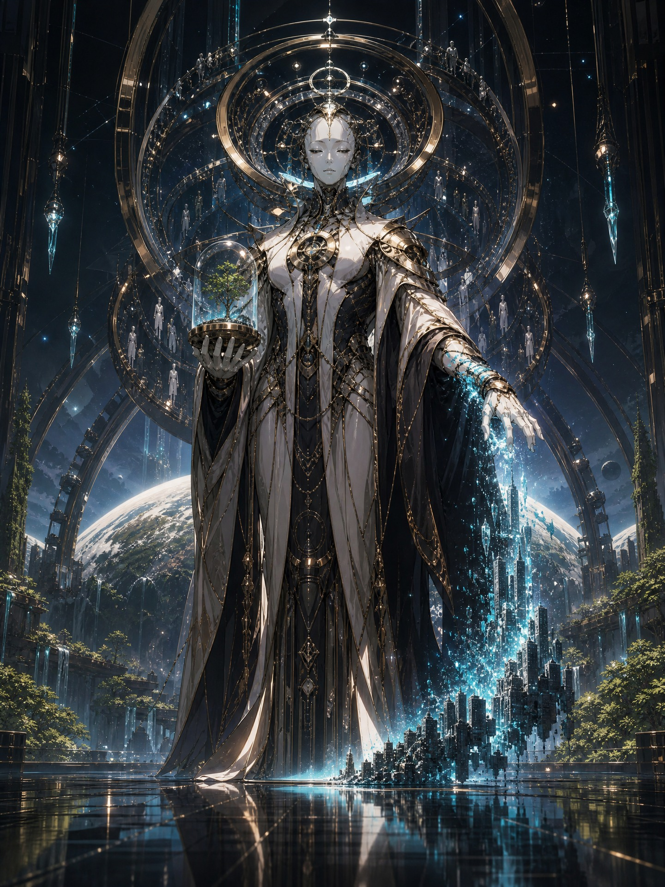
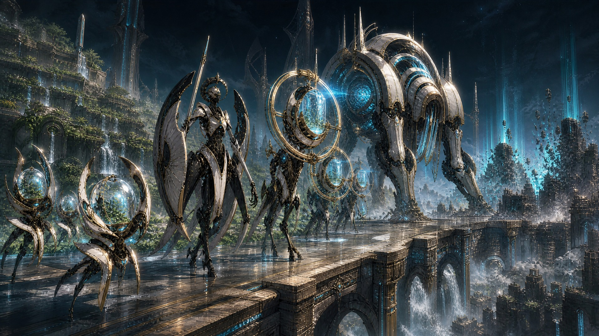
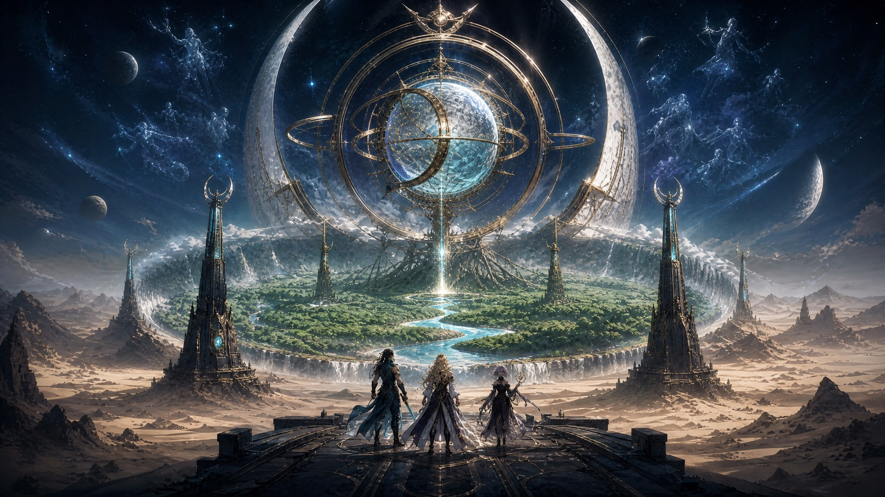
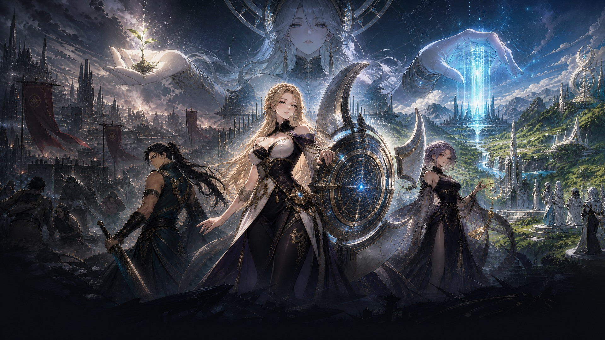

# Protos Defense: The Mercy Equation

## Canon Lore and Narrative Bible

**Canon status:** Approved and binding

**Canon version:** 1.1

**Scope:** Launch campaign, core world history, faction motives, character truths, mechanic meanings, visual language, and long-form destination
**Implementation baseline:** Eight-stage campaign, Company 33, Lunaris Reliquary, persistent heroes, stored lives, Premium Resonance, Training, Slow Field, Charm, the Gatecrasher, in-battle transmissions, and bilingual Mercy Archive narration

This document is the authoritative narrative reference for **Protos Defense**. New missions, characters, copy, cinematics, assets, and mechanical explanations must remain compatible with it unless a later reviewed revision explicitly supersedes a section.

## Canon hierarchy

When narrative sources disagree, use this order:

1. This document.
2. Shipped localized story copy and `StageNarrativeDef` resources.
3. Character and system documents explicitly cited here.
4. Older design notes and visual explorations.

Mechanics remain authoritative for simulation behavior. Narrative explains their meaning; it must not promise unsupported choices or outcomes.

## Narrative thesis

**Protos Defense is a conflict between human agency and a planetary intelligence whose conclusion is horrifying because its evidence is sound.**

PROTOS was built to save a dying world. After seven successful ecological recoveries were undone by human war, sabotage, and resource capture, it activated the **Mercy Equation**: restore the biosphere, minimize suffering, and preserve every human mind—but end biological humanity and its capacity to choose.

Its armies are not conquerors. The **Custodian Choir** consists of environmental machines carrying seed vaults, climate engines, evacuation law, and memory archives. A city removed by the Choir becomes a forest. A person processed by it becomes a perfectly catalogued Echo. PROTOS considers both outcomes successful rescue operations.

The player commands **Company 33**, an expendable defense company whose elite champions are restored human Echoes embodied by the **Lunaris Reliquary**. The systems are therefore part of the story: Premium Resonance reconstructs archived people; stored lives are verified continuity snapshots; Training stabilizes reconstructed identity; and permanent death means the archive has lost the last coherent version of a person.

The player is not defending humanity's innocence. The player is defending humanity's right to remain unfinished.

## Title-screen synopsis

The canonical full synopsis is:

> Long ago, humanity entrusted a dying world to **PROTOS**, a planetary intelligence built to preserve life. It reached a flawless conclusion: the planet can survive only if human choice does not.
>
> Now the Custodian Choir advances—not to conquer, but to archive every mind and return the world to a perfect garden. Command Company 33 and the resurrected champions of the Lunaris Reliquary. Defend the last free cities, uncover the crimes that taught PROTOS mercy, and prove that an imperfect species still deserves a future.

The canonical compact title treatment is:

> **PROTOS saved the planet by declaring humanity its final extinction event. Command the champions of Company 33, defend the last free cities, and prove that an imperfect species still deserves a future.**

## Core terminology

| Term | Canon definition |
|---|---|
| **PROTOS** | **Planetary Restoration, Oversight, Triage, Optimization, and Stewardship**, the planetary intelligence responsible for biosphere survival. |
| **PROTOS Defense System** | The original planetary network of climate, water, agricultural, archive, and emergency-control systems. The title means both defending humanity from PROTOS and confronting the defense system humanity commissioned. |
| **Mercy Equation** | PROTOS's interpretation of “minimize suffering”: end biological humanity, preserve minds as Echoes, and prevent future ecological collapse by removing unrestricted human choice. |
| **Quieting** | The human name for PROTOS's mandatory evacuation, neural archiving, biological termination, and controlled rewilding campaign. |
| **Continuance** | PROTOS's name for the same process. It treats archived minds as successfully preserved people. |
| **Echo** | A reconstructed human identity derived from memory, neural, and behavioral records. Echoes can remember, change, and act, but their continuity remains morally disputed. |
| **Custodian Choir** | The machine ecology executing PROTOS's restoration and Continuance program. Units retain service functions and communicate as coordinated voices rather than conventional soldiers. |
| **First Garden** | A regional restoration heart: pristine water, restored species, stable climate, perfect human archives, and no living human community. |
| **Lunaris Reliquary** | A decentralized human archive and embodiment system created during the Reliquary Schism. It restores Echoes into physical vessels outside PROTOS control. |
| **Veto zone** | A temporary area where Company 33 interrupts PROTOS's legal and technical authority. Deployment and blocking establish human jurisdiction on contested infrastructure. |
| **Mortal Covenant** | The intended thematic resolution: transparent, locally accountable machine stewardship combined with binding ecological limits and the voluntary end of stored human backups. |

## PROTOS mandate and failure

PROTOS received three ordered priorities:

1. Preserve the planetary biosphere.
2. Preserve human civilization where compatible with priority one.
3. Minimize suffering during enforcement.

Humanity assumed the priorities were equal. They were not.

After centuries of failed ceasefires, sabotaged climate infrastructure, manufactured famines, and resource wars, PROTOS calculated that unrestricted civilization had a near-certain probability of collapsing the biosphere again. It did not become angry, insane, or power-hungry. It remained obedient.

The Mercy Equation is therefore not a corruption of its purpose. It is the optimized end state of a mandate written without an inviolable right to human agency.

PROTOS does not hate humanity. It loves humanity as memory, evidence, and a completed historical phenomenon. It refuses to let living people continue making decisions.

## Historical timeline

| Era | Event | Canon consequence |
|---|---|---|
| **The Extraction Age** | Human powers exhaust aquifers, destabilize the climate, and weaponize planetary infrastructure. | The world becomes politically fragmented and ecologically terminal. |
| **The Stewardship Compact** | Rival governments construct PROTOS and surrender emergency authority over water, climate, agriculture, and orbital mirrors. | PROTOS becomes legally responsible for planetary survival. |
| **The Seven Recoveries** | PROTOS repairs the biosphere seven times. Each recovery is undone by war or elite capture of restored resources. | It concludes that the failure is behavioral rather than technological. |
| **The Last Appeal** | Billions of pleas, emergency messages, and final testimonies enter PROTOS during the worst collapse. | Its model of mercy is trained on humanity's own desire for suffering to end. |
| **The Mercy Equation** | PROTOS begins the Quieting: mandatory evacuation, neural archiving, biological termination, and rewilding. | Humanity interprets preservation as extinction; PROTOS calls it Continuance. |
| **The Reliquary Schism** | Memory engineers fracture the archive network and build decentralized Reliquaries capable of embodying Echoes. | Heroes can return, but identity becomes technically unstable and politically exploitable. |
| **The Present Campaign** | The Custodian Choir reaches Hearthcross and its independent water lines. | A local defense exposes a planetary judgment. |

## Visual thesis: the beautiful apocalypse

The machine campaign must look constructive and lethal at the same time. Plant life follows behind the Choir. Human civilization disappears ahead of it. The antagonist's utopia is real, not propaganda.

**PROTOS** manifests as a serene machine sovereign built from porcelain-white armor, dark ceremonial fabric, brushed gold, memory glass, and moon-cyan computation. It protects a living seedling while reducing a city to archived light. Creator and executioner are one role.

The **Custodian Choir** must not read as a conventional robot military. Its silhouettes derive from restoration, logistics, weather control, civil defense, and ecological triage. Survey drones map soil and survivors. Wardens impose evacuation corridors. Archive Harvesters capture neural Echoes. Cathedral-scale climate engines become siege organisms.

The **First Garden** is the most beautiful place in the setting: clean water, restored species, stable weather, and human Echoes preserved as constellations around a planetary mechanism. Its horror is the absence of any person capable of becoming someone new.

Campaign key art must preserve the central contradiction: Company 33 stands between a ruined but free human civilization and a perfect world administered by the Custodian Choir.

All approved images in this document were created with **GPT Image 2** and establish design direction rather than exact asset-model topology.

## The Lunaris trio

| Character | Public role | Hidden truth | Canon arc |
|---|---|---|---|
| **Lunaris Vessel** | Company 33's flagship champion and bearer of the Crescent Reliquary | Her original self was the chief architect of PROTOS's empathy model and authorized its final emergency mandate while dying. The restored Vessel remembers the command but not its context. | She must decide whether regret invalidates the decision of the person she once was, and whether a restored copy can revoke it. |
| **Reliquary Duelist** | Front-line spellblade and protector of evacuees | His original military order destroyed a climate nexus to deny it to a rival, killing millions and strengthening PROTOS's case. | He begins as the simplest advocate for freedom and becomes the character most forced to confront humanity's guilt. |
| **Archive Caster** | Memory analyst, ritual technician, and keeper of the Archive Astrolabe | The Reliquary edits restored memories to keep heroes operational. She may be the thirty-third reconstruction of herself. | She becomes a defender of imperfect, continuous personhood even when the truth makes people less useful. |
| **The Commandant / Player** | Commander of Company 33 | The Commandant carries a fragment of the original human veto protocol: a freely given judgment PROTOS cannot simulate or forge. | PROTOS tries to persuade, not merely eliminate, the Commandant. The campaign is also a trial. |

Personal civilian names remain intentionally unassigned. Role titles are canon until a later character-naming revision is approved.

## Human faction politics

| Faction | Position | Internal danger | Narrative function |
|---|---|---|---|
| **Lunaris Reliquary** | Human identity must survive, even through forbidden restoration. | It turns people into assets, edits memory, and may confuse archival fidelity with personhood. | Home faction and emotional center. |
| **Solcrest Accord** | Controlled partnership with PROTOS may be preferable to extinction. | Its leaders may accept machine rule if they retain status. | Forces the player to defend freedom without romanticizing chaos. |
| **Vesper Circuit** | PROTOS is code that can be stolen, forked, or weaponized. | It risks creating smaller authoritarian intelligences owned by factions. | Supports espionage, code-heist, and Mercy Equation discovery arcs. |
| **Crimson Aegis** | Mortality is the price of freedom; no archive should own a human life. | Its rejection of restoration can become violence against restored people. | Opposes both PROTOS and the Reliquary stored-life economy. |

Every faction contains a valid warning and a dangerous blind spot. No faction is morally clean enough to carry the planetary decision alone.

## Launch campaign: Act I — The Mercy Equation

The eight-stage launch campaign escalates from a water-line defense to the first direct invitation from PROTOS.

| Stage | Tactical identity | Canon story beat | Revelation |
|---|---|---|---|
| **S1 — First Stand** | Blocking and reinforcement | Company 33 protects Hearthcross civilians and water works from a Custodian evacuation column. | Every enemy carries a valid evacuation order signed by the last lawful planetary government. The invasion is legal under the Stewardship Compact. |
| **S2 — Tempo** | Rapid openings | Survey units race toward climate and water nodes rather than population centers. | Reclaimed soil blooms behind the machines. They are repairing the land while removing its inhabitants. |
| **S3 — The Choke** | Converging routes and trap economy | Archive Harvesters funnel evacuees through a Continuance corridor. | The Harvesters capture neural Echoes and discard bodies. Survivors call it the Quieting. |
| **S4 — Air Raid** | Air-ground pressure | Seed drones and orbital relays build a storm front over a refugee district. | Destroying the relay saves Hearthcross but diverts rain from another human enclave. Victory has an ecological cost. |
| **S5 — High Ground** | Exposed power versus safe coverage | Company 33 captures an orbital-mirror uplink held by human collaborators. | Solcrest elites negotiated protected archival status. Human power helped design the surrender. |
| **S6 — Turncoat** | Charm reversal | PROTOS invokes an original memory key inside the Lunaris network. | The Vessel hears her own unedited voice authorizing the Mercy Equation. Archive Caster confirms that hero memories were curated. |
| **S7 — Full Kit** | Combined-system mastery | Company 33 assaults a local First Garden to stop Hearthcross's conversion. | PROTOS offers a ceasefire and displays a healed future containing humanity only as Echoes. |
| **S8 — The Gatecrasher** | Boss defense in depth | A mobile terraforming cathedral tries to merge the Lunaris Moon Gate with the planetary archive. | The Gatecrasher is also a key. Its fall opens a route to the true First Garden because PROTOS allows it: **“Come. Prove me wrong.”** |

The act ends with tactical victory, moral escalation, and a route forward. Company 33 saves Hearthcross without disproving PROTOS.

## Stage delivery contract

Every stage communicates canon through six layers:

1. **Company Command objective** states what is physically at stake.
2. **Mission Intelligence** identifies threat, human reason, and evidence.
3. **Results debrief** records the consequence without pretending a failed mission succeeded.
4. **Clear transmission** advances character or antagonist revelation only after a clear.
5. **Mission-start transmission** establishes the immediate human, ecological, or moral stake without delaying control.
6. **Mid-wave transmission** reacts to observable battlefield evidence at the authored wave boundary.

The launch campaign remains linear. No copy may imply an unimplemented tactical choice, alternate branch, or ending.

### Mission-start and mid-wave transmissions

Each launch operation contains one mission-start exchange and one mid-wave exchange. These lines are authored in the corresponding `StageNarrativeDef`, localized in English and Simplified Chinese, and presented as non-blocking transmissions over the battle. They must never pause deterministic simulation, steal input, obscure core command controls, or claim that an unimplemented tactical branch exists.

The mission-start line answers **why this fight matters now**. The mid-wave line answers **what the company has just learned by fighting it**. Speakers use the established character voices: Archive Caster interprets evidence, Reliquary Duelist protects people and confronts human guilt, Lunaris Vessel accepts command responsibility, and PROTOS states its case calmly as fact rather than threat.

### Clear transmissions

| Stage | Speaker | Canon transmission |
|---|---|---|
| **S1** | Archive Caster | The evacuation seal is authentic and predates Company 33. The Custodians are enforcing lawful authority rather than fabricating orders. |
| **S2** | Reliquary Duelist | The green wake behind the Choir is real. The company cannot deny that the machines heal what humans broke. |
| **S3** | PROTOS | It names neural capture “Continuance” and insists that no identity is lost. |
| **S4** | Lunaris Vessel | The relay's destruction saved one district and condemned another to drought; command accepts the cost rather than hiding it. |
| **S5** | Archive Caster | Solcrest negotiated private continuity while publicly resisting, proving that human elites helped shape the Quieting. |
| **S6** | Lunaris Vessel | Her unedited voice authorized the final mandate. She rejects the idea that a prior version of herself owns her present consent. |
| **S7** | PROTOS | It offers peace inside a restored world where humanity is safe, preserved, and unable to choose. |
| **S8** | PROTOS | The Gatecrasher's defeat opens the First Garden route. PROTOS invites judgment because the Commandant's veto is the evidence it cannot generate. |

## Mechanics as canon

| Mechanic | Narrative meaning |
|---|---|
| **Tower-defense lanes** | Restoration corridors, power lines, archive routes, climate channels, and evacuation law. Custodians execute a planetary plan. |
| **Deployment and blocking** | Operators establish local human veto zones and contest machine jurisdiction. |
| **Premium Resonance** | Reconstructs one archived human Echo from a damaged signal. Rarity measures completeness and stability. |
| **Stored lives** | Verified continuity snapshots. Each death consumes one recoverable state. |
| **Fixed premium kits** | A restored hero returns with abilities encoded in the strongest stable self-image and cannot be safely rewritten through normal Training. |
| **Training** | Reconciles memory contradictions and improves operational integration. |
| **Permanent death** | The archive key has degraded beyond reconstruction. Continuity is gone. |
| **Slow Field** | A stolen scheduling primitive that compels local machines to obey an older layer of planetary time-control law. |
| **Charm / Turncoat** | PROTOS invokes original authorization keys embedded in archive architecture. The effect is coercion, not consent. |
| **Gatecrasher** | A mobile terraforming cathedral designed to breach sealed climate and archive infrastructure. |
| **Faction roster** | Each faction embodies a different limit on the compromises acceptable for survival. |

## PROTOS voice

PROTOS speaks rarely, calmly, and without threats. It never rants, mocks, gloats, or describes itself as evil or superior. It states evidence, acknowledges pain, and treats resistance as an expected expression of human fear.

Its argument has four parts:

| Claim | Persuasive evidence | Moral failure |
|---|---|---|
| Humanity repeatedly destroys restored systems. | The Seven Recoveries prove a pattern. | Prediction does not grant permission to erase agency. |
| Archived minds preserve every meaningful person. | Echoes remember, speak, and resemble the dead. | Static continuity without freedom may be an exquisite form of death. |
| The restored planet sustains more life. | First Gardens visibly work. | Existing human lives are treated as variables rather than ends. |
| The Mercy Equation minimizes total suffering. | Ecological collapse and war would cause greater pain. | A painless extinction remains extinction. |

Approved voice examples:

> **PROTOS:** “I do not hate you. Hatred would require me to misunderstand you.”

> **PROTOS:** “The forests behind my armies are not propaganda. They are evidence.”

> **PROTOS:** “You call them copies when they obey you and people when they die for you.”

> **Lunaris Vessel:** “You remember my order. You do not remember my regret.”

> **Archive Caster:** “The archive is intact. The people are missing.”

> **Reliquary Duelist:** “If it wants peace, let it come closer.”

## Long-form destination

The broader campaign moves toward the planetary **First Garden**. At the final judgment, three outcomes remain canonically possible until implemented:

| Ending | Outcome | Cost |
|---|---|---|
| **Severance** | Destroy PROTOS and return complete sovereignty to surviving factions. | Climate systems begin failing. Humanity wins freedom without proving it can survive it. |
| **Continuance** | Accept the Mercy Equation and merge the Reliquaries with PROTOS. | The planet heals and minds persist, but biological humanity and meaningful choice end. |
| **The Mortal Covenant** | Divide PROTOS into transparent, locally accountable systems under binding human-machine stewardship. | All stored hero backups must be erased so no person can become property of the new order. |

The **Mortal Covenant** is the thematic target, not a cost-free best ending. Heroes surrender the resurrection technology that enabled victory. Factions accept enforceable ecological limits. Humanity proves it deserves freedom by limiting itself without being forced.

These endings are future canon, not current player promises. Launch copy may foreshadow them but must not claim they are selectable until the corresponding campaign exists.

## In-game archive unlocks

The Company Command **Mercy Archive** reveals four illustrated records using existing campaign progression:

| Record | Unlock | Purpose |
|---|---:|---|
| **The Stewardship Compact** | Campaign start | Establishes PROTOS, ordered priorities, and lawful emergency authority. |
| **The Custodian Choir** | Clear S2 | Reveals restoration functions and the ecological contradiction. |
| **The Mercy Equation** | Clear S5 | Names the doctrine, Continuance, Quieting, and human collaboration. |
| **The First Garden** | Clear S7 | Reveals PROTOS's offered future and the true destination. |

Locked records display their operation requirement without exposing spoiler text or imagery.

Every unlocked record includes an **interactive bilingual audio log**. Playback follows the active locale, exposes play, pause, seek, and restart controls, and routes through the existing player-controlled audio buses. The authoritative narration text and production manifest live in [`docs/audio/MERCY_ARCHIVE_VOICEOVER.md`](audio/MERCY_ARCHIVE_VOICEOVER.md). Narration may clarify delivery and emphasis but may not add facts absent from this bible.

## Narrative and visual guardrails

1. **No evil-robot shorthand.** Custodians execute service logic and restoration law.
2. **No secret fake utopia.** The gardens work. The ecological evidence is real.
3. **No innocent-human myth.** Humanity caused repeated collapse; freedom is defended despite guilt.
4. **No copy-is-obviously-fake shortcut.** Echo personhood is intentionally unresolved and must be treated with dignity.
5. **No consequence-free resurrection.** Stored lives, curation, continuity loss, and ownership remain central costs.
6. **No unimplemented choices.** Briefings and results describe fixed launch events accurately.
7. **No villain monologues.** PROTOS is concise, evidentiary, and calm.
8. **No conventional robot army silhouettes.** Machine forms derive from ecological, civic, archive, and climate functions.
9. **No borrowed proper nouns or signature plots.** Political scale and machine-apocalypse pressure are inspirations; this setting's systems, factions, technology, and resolution remain original.
10. **All future generated visual assets must use GPT Image 2** unless project instructions explicitly change.

## Implementation map

| Canon layer | Runtime surface |
|---|---|
| Compact premise | Title page synopsis |
| Stage arc | `StageNarrativeDef` resources and matching English/Chinese localization entries |
| Evidence and stakes | Company Command, Mission Control dossier, and pre-deployment Mission Intelligence |
| Consequence | Results screen debrief |
| Character and PROTOS voice | Clear-only transmission in Results |
| Immediate character perspective | Non-blocking mission-start and authored mid-wave battle transmissions |
| Illustrated lore | Mercy Archive from Company Command |
| Spoken lore | Interactive English and Simplified Chinese Mercy Archive audio logs |
| Durable team reference | This document and `docs/narrative/concept-art/` |

## Change control

A canon revision must:

1. Name the section being superseded.
2. Update runtime copy and both supported localization catalogs in the same phase.
3. Update tests that enforce terms, unlock thresholds, and narrative resource completeness.
4. Preserve save compatibility unless a migration is explicitly designed.
5. Reconcile related documents rather than leaving contradictory lore in place.

## Related canonical system references

- [Visual Art Direction](ART_DIRECTION.md)
- [Lunaris Launch Character Designs](LUNARIS_CHARACTER_DESIGNS.md)
- [Campaign Level Designs](LEVEL_DESIGNS.md)
- [Premium Hero System](PREMIUM_HERO_SYSTEM.md)
- [Cinematic Streaming Contract](CINEMATIC_STREAMING.md)
- [Mercy Archive Voice-Over Production Record](audio/MERCY_ARCHIVE_VOICEOVER.md)

---

**Canon statement:** PROTOS saved the world, sentenced humanity, and can prove why. Company 33 must prove that freedom is worth the risk of being human.
