# TORCHLIGHT & STEEL — Game Art Style Proposal

**Prototype TD · Art direction proposal · 2026-08-11**
**Register:** fantasy dungeon-crawl × gacha anime — *Dungeons & Dragons / Lord of the Rings* material world, rendered with *Mushoku Tensei / Genshin Impact* character charm.
**Status:** proposal for vetting. Reference art in `docs/art/reference/` was generated procedurally this session (no image-model API is available on this machine); every character below carries a **generation-ready gpt-image-2 prompt** so the same designs can be re-rendered through an image model the moment access exists.

---

## 1. What the game is (context the art must serve)

Arknights-pattern tactical tower defense on a 2:1 isometric dungeon board. Enemies pour from spawn gates and march lanes toward the ward-crystal base; the player spends DP to deploy hero operators onto cells — melee heroes onto the lane to block, ranged heroes onto ledges to shoot over it. Heroes have skills on SP timers; traps and spells layer on top. Readability under pressure is the first duty of every art decision: *who is a hero, who is an enemy, where is the lane, what cell does this thing own.*

## 2. The two-representation contract

Every hero **and** every enemy ships as a pair sharing one identity kit (hair/head silhouette + 1–2 accent colors + signature prop):

| | Key art (gacha register) | Iso battle sprite (board register) |
|---|---|---|
| Purpose | roster, recruit reveal, dialog, marketing | the actual game piece |
| Framing | full body, dynamic action pose | idle/stride on a 64×32 diamond |
| Proportions | 5.5–6.5 heads, anime illustration | 2.5–3 head chibi |
| Native size | 128×224 px (procedural lane) / 2048px (image-model lane) | 64×64 px, feet pivot at (32, 60) |
| Rendering | cel shading, 3–4 tone hue-shifted ramps, selective linework | same ramps, exterior outline, reads at 1× |

The split is the Arknights pattern: the board piece is a toy; the key art is the promise. Identity survives the jump because silhouette, accent, and prop are pinned per character — not rendering detail.

## 3. Palette law

All art draws from **TD32**, the project's 32-color hue-shifted palette (`tools/pixel/palette.gd`, mirrored in `tools/artgen/painter.py`). Shading steps *along a ramp* (shadows cooler, highlights warmer) — never value-scales a single hue. Named ramps: `fire` (VOID→WINE→CRIMSON→CORAL→GOLD→PALE_GOLD), `steel`, `leaf`, `storm`, `arcane`, `earth`, `skin`.

Class color families: **vanguard** leaf-green · **guard** fire-crimson · **defender** storm-teal/steel · **sniper** earth-gold · **caster** arcane-orchid. Enemies live in desaturated cold ranges (slate, umber, wine) with one hostile accent so heroes always read warmer and cleaner than what they fight.

**Probe reservation (unchanged, non-negotiable):** WHITE `#f4f4f4` and SKY `#41a6f6` belong to the verification harness (tracer/flash and charm probes) and are banned from all art. `painter.lint()` enforces this mechanically on every generated asset.

## 4. Isometric alignment (numbers that don't move)

The board projection is pinned in `scripts/view/iso_projection.gd`: tile diamonds **64×32**, elevation lift **16 px**, sprite feet at **face-center + 6 px**, depth `2·(x+y)` with entities at `+1`. Iso sprites are authored 64×64 native with the body inside ≤56 px width so a unit never laps its neighbor cells; on-screen unit size stays 64 px (the current view renders 32×32 art at a pinned 2× — adopting 64×64 native requires the one-time per-asset `screen_px` manifest field before any art swap, since `battle_view.gd:12` hardcodes `SPRITE_SCALE := 2`).

## 5. The world — art pillars & terrain

### The Statement

Somewhere under the mountain there is a door nobody opens twice. Beyond it: galleries of cold flagstone older than any kingdom, moss creeping through the mortar lines, and a single road of packed earth beaten flat by ten thousand marching feet — lit, every dozen paces, by a torch someone keeps burning. This is where our game lives. **TORCHLIGHT & STEEL** is the collision of two loves: the *material gravitas* of D&D and Lord of the Rings — worn steel that has been sharpened too many times, boiled leather gone dark at the creases, stone that drinks the light, moss and rust and rope — and the *anime charm* of Mushoku Tensei and Genshin Impact — enormous expressive eyes, hair that moves like a battle flag, poses caught at the exact top of the swing, and color logic so clean you can name every character by a single accent hue at a hundred paces.

The tension between those two registers is the style. Materials are always honest: steel is cold, leather is warm, stone is heavy, and nothing looks new. But *people* are always vivid: a face is never lost to grime, a silhouette is never muddied by realism, and every hero carries one saturated accent — a leaf-green sash, a crimson plume, an orchid glow between the fingers — that survives from the 128×224 key art all the way down to the 64×64 chibi on the board. The dungeon is the bass line; the operators are the melody. When a Vanguard in green steps onto grey flagstone beside a torchlit earthen lane, the whole composition should read in one glance: *cold world, warm road, bright hero.*

Everything is built on the **TD32 palette** with hue-shifted ramps — shadows step cooler down a ramp, highlights step warmer up it, and no material is ever shaded by "the same color but darker." Two colors are law-level banned from art: probe-reserved **WHITE `#f4f4f4`** and **SKY `#41a6f6`**. The brightest thing in any frame is PALE_GOLD torchlight or a PALE rim; the bluest is CYAN storm-glass. One key light, top-left, always — as if the same unseen torch sconce lights every character sheet and every tile in the set.

### The Five Pillars

1. **Silhouette first, always.** Every character, tile, and prop must be identifiable as a black shape. Key art is designed by blocking the silhouette before a single interior pixel; the 64×64 iso sprite is the silhouette's final exam. If the chibi doesn't read at 1×, the design fails — no amount of interior detail rescues a mushy outline.

2. **One world, two registers.** Environments carry the LotR register: desaturated, weathered, materially honest — flagstone in steel greys, moss in deep greens, torchlight in earth golds. Characters carry the gacha-anime register: cel-shaded, high-chroma accents, expressive faces. The registers never bleed: no gritty faces, no candy-colored dungeons. The contrast *is* the look.

3. **The palette is law; the ramps are grammar.** Only the 30 legal TD32 colors (WHITE and SKY are probe-reserved and banned). All shading steps down a hue-shifted ramp from `painter.RAMPS` — fire, steel, leaf, storm, arcane, earth, skin — cooler in shadow, warmer in light. Class families are fixed vocabulary: **vanguard = leaf greens, guard = fire crimsons, defender = storm/steel teals, sniper = earth golds, caster = arcane orchids.** A player who learns the color code once reads every future character for free.

4. **One identity kit, two bodies.** Every character exists as (A) a full-body anime action-pose key art at 5.5–6.5 heads and (B) a 64×64 isometric chibi at 2.5–3 heads, feet pivoted at bottom-center. Both share one identity kit — hair silhouette + hair color, one or two accent colors, one signature prop — and the kit is the *contract*: if you cover the face, the hair and prop alone must still say who this is, at either scale.

5. **Torchlight is the drama; legibility is the boss.** One key light, top-left, warm; shadows fall bottom-right, cool; optional PALE or STEEL rim on the back edge. Warm light is *spent* deliberately — the enemy lane, the torch sconces, the ward-crystal — so warmth itself becomes game information. Whenever a beautiful choice fights a legible one, legibility wins: this is a tactics board before it is a painting.

---

### The Dungeon Terrain Set

#### Lighting doctrine — torch warm vs ambient cool

The entire board runs on a two-temperature system. **Ambient light is cool**: the base state of the dungeon is the `steel` ramp (VOID → DUSK → SLATE → STEEL → PALE) with `storm` accents — this is the color of stone that has never seen the sun. **Torchlight is warm**: everything the invaders touch or the players fight over is pushed through the `earth` and `fire` ramps (UMBER → BROWN → BRONZE → GOLD → PALE_GOLD). The key light is pinned top-left on every tile, exactly as on every character, so tiles and sprites composite as one lit scene: the top-left edge of every raised form catches a warmer, lighter ramp step; the bottom-right facet falls one or two steps down-ramp and cooler. Torch pools are painted as local warm gradients *inside* the cool field — a GOLD core fading through BRONZE into the surrounding SLATE — never as full-tile recolors. The rule of thumb a level artist can apply blind: **cool = safe/static, warm = threat/traffic, saturated glow = objective.**

#### How elevation reads

Elevation is sold with three cheap, stackable cues, strongest first. **(1) The lit rim:** every raised tile's top surface is one ramp step *lighter* than ground (STEEL top vs SLATE ground) and its top-left edge carries a 1–2 px PALE catch-light — height literally sits closer to the torch. **(2) The dropped face:** raised tiles expose a visible south-east cliff face two ramp steps *darker* (DUSK → VOID), with vertical tool-mark striations, so the eye reads a solid block, not a floating decal. **(3) The cast shadow:** a hard-edged DUSK shadow skirt falls on the ground tile to the bottom-right of any elevation, knitting the two heights into one scene. Ranged-deployable ledges additionally carry a subtle bleached-moss dusting (GREEN stepped up to LIME along the lit edge) — the only place LIME appears in terrain — so "I can put a Sniper here" is a color read, not a tooltip read.

#### The tile set

All tiles: 64×32 isometric diamond footprint (elevated/blocked/spawn/backdrop tiles extend upward on the 64×64 canvas), hard alpha, exterior VOID outline where they meet void, top-left key light, TD32 only, WHITE/SKY banned.

---

##### `tile_ground` — Mossy Flagstone

**Physical description.** The default walkable floor of the delve: massive quarried flagstones, each slab worn saddle-smooth in the center and chipped at the corners, laid in an irregular broken-course pattern (3–5 visible slabs per diamond so the tiling never moirés). Mortar lines are recessed and dark; moss colonizes the joints and the perpetually damp north-east corners in soft-edged patches. One slab in ~4 carries a hairline crack; one in ~8 a shallow spall. No two adjacent tiles should share an identical slab layout — cut 2–3 layout variants.

**Palette ramps.** Body: `steel` (DUSK mortar shadows → SLATE slab body → STEEL worn centers, PALE only as rare 1 px chips on lit edges). Moss: `leaf` low registers (DEEP_GREEN → GREEN; no LIME — LIME is reserved for elevated ledges). Grime pass: sparse UMBER speckle from `earth`.

**Legibility role.** The neutral field. It must be the *quietest* tile in the set — mid-value, low chroma, low internal contrast — so that deployed operator sprites (and their saturated class accents) pop against it at 1×. Moss density stays below ~15% coverage so green never confuses the vanguard-green class read.

**gpt-image-2 prompt.**
```
isometric 2:1 game tile, 64x32 diamond footprint, ancient dungeon flagstone floor, large worn grey stone slabs with recessed dark mortar joints, patches of deep green moss in the cracks, cool slate-and-steel grey palette with dark blue-grey shadows, single warm key light from top-left, subtle chipped edges, clean cel shading, crisp pixel-art edges, hand-painted fantasy tactics-game terrain, muted and quiet so characters read on top, no pure white, no sky blue, transparent background
```

---

##### `tile_road` — The Torchlit Lane

**Physical description.** The enemy road: packed earth and crushed gravel pounded into a shallow trough by generations of marching boots, running seamlessly tile-to-tile as one continuous lane. Twin wheel-ruts and overlapping bootprints texture the center; the earth humps slightly at the lane's shoulders where it meets flagstone, with a broken kerb of half-buried stones marking the transition. Warm torch pools wash the lane at intervals — a GOLD hotspot fading through BRONZE — and small embedded details (a dropped horseshoe, a splintered arrow, scattered straw) sell the traffic. Directional variants (straight ×2 axes, corners ×4, T, cross) all keep the rut-lines flowing with the path direction so the lane itself points where enemies will walk.

**Palette ramps.** Body: `earth` (UMBER rut shadows → BROWN packed soil → BRONZE lit crown → GOLD torch pools, PALE_GOLD only as 1–2 px torch-core specks). Kerb stones: `steel` low steps (DUSK/SLATE) to hand off to ground. Optional ember flecks: single CORAL pixels from `fire`, very sparse.

**Legibility role.** THE core board read: **warm lane through cool stone**. The road is the only large warm-hued surface on the floor plane, so at any zoom the enemy path reads as a glowing river of earth-tones through slate — a glance tells you where the fight will be. Its value range is pinned mid-dark (BROWN-centered) so enemy sprites, which trend cool/dark, silhouette against it, and its chroma stays in earth-gold so guard-crimson and sniper-gold *accents* still separate (accents are small and saturated; the lane is broad and muted).

**gpt-image-2 prompt.**
```
isometric 2:1 game tile, 64x32 diamond footprint, torchlit packed-earth dungeon road, warm brown compacted soil with wheel ruts and overlapping bootprints, edges of half-buried kerb stones meeting grey flagstone, pools of warm golden torchlight fading to umber shadow, warm earthy bronze-and-gold palette deliberately warmer than surrounding cool stone, single warm key light from top-left, clean cel shading, crisp edges, fantasy tactics-game enemy-path terrain, no pure white, no sky blue, transparent background
```

---

##### `tile_elevated` — The Ranged Ledge

**Physical description.** A raised rampart block, one half-story above the floor: a dressed-stone ledge whose flat top is edged with a low, crenellated lip (a broken merlon or two — this platform is old). The south-east cliff face is exposed masonry — big ashlar blocks with visible chisel striations and one weeping damp streak — dropping to a hard cast shadow on the ground below. The top surface is bleached brighter than the floor, dusted with pale dried moss along the lit north-west edge, and bears a single carved socket-ring (an old ballista mount) that doubles as the deploy-point marker. An iron ring and a coil of rope on the face hint that people climb up here on purpose.

**Palette ramps.** Top: `steel` upper registers (STEEL body → PALE lit-edge highlights). Cliff face: `steel` lower registers (SLATE → DUSK → VOID at the base) plus UMBER water-stain from `earth`. Dried-moss dusting: `leaf` top step (GREEN → LIME along the lit rim — the terrain set's only LIME). Iron fittings: DUSK with STEEL glints.

**Legibility role.** The "high ground" read and the ranged-deploy affordance. Three elevation cues at full strength: lightest top surface on the board, darkest exposed face, hardest cast shadow. The LIME moss-lip is the deployability tell — snipers and casters go where the pale green edge is. Top surface stays as flat and quiet as tile_ground so the deployed sprite owns the tile.

**gpt-image-2 prompt.**
```
isometric 2:1 game tile with raised height, elevated stone rampart ledge one half-story above a dungeon floor, flat pale grey dressed-stone top with a low broken crenellated lip, exposed south-east masonry cliff face in dark slate with chisel marks and a damp streak, hard shadow cast on the ground to the lower right, pale dried moss catching light along the top-left edge, cool steel-grey palette with the top surface distinctly brighter than ground level, single warm key light from top-left, clean cel shading, fantasy tactics-game ranged-deployment platform, no pure white, no sky blue, transparent background
```

---

##### `tile_spawn` — The Dungeon Gate

**Physical description.** The mouth of the deep roads: a massive arched gateway set in cyclopean stonework, its portcullis wrenched upward and frozen at half-height — bent bars, one snapped tine — so the passage under it gapes permanently open. Inside the arch is layered darkness: VOID at the core, stepping out through NAVY to a faint TEAL miasma curling along the floor line, the storm-glow of whatever is coming. The arch's keystone bears a crude warning glyph struck through with claw marks. Rubble and a snapped spear litter the threshold; two guttering wall-torches flank the arch, their warm light *failing* against the doorway's cold exhalation — the one place on the board where warm loses to cold.

**Palette ramps.** Masonry: `steel` (SLATE → DUSK, VOID recesses). Portal depths: `storm` (VOID core → NAVY → TEAL floor-mist; CYAN only as 1–2 px glints deep inside). Flanking torches: `fire`/`earth` tips (BRONZE → GOLD, CORAL flame core). Threshold debris: UMBER/BROWN.

**Legibility role.** Threat origin. It must be findable in under a second from a full-board glance: it is the *darkest* tile on the board and the only one where storm-teal glow emerges at floor level. The half-fallen portcullis silhouette (vertical bars over a black arch) is unique in the tileset — nothing else on the board has that shape grammar. Where multiple spawns exist, the TEAL mist animates as a slow pulse: the board's heartbeat of danger.

**gpt-image-2 prompt.**
```
isometric 2:1 game tile with tall structure, ancient dungeon gateway arch of massive dark stone blocks, iron portcullis jammed half-raised with bent and snapped bars, pitch-black passage beyond fading from void black through deep navy to a faint cold teal mist curling out along the floor, crude warning glyph on the keystone, two small guttering torches flanking the arch overpowered by the cold dark, broken spear and rubble at the threshold, ominous enemy spawn gate for a fantasy tactics game, single warm key light from top-left, clean cel shading, no pure white, no sky blue, transparent background
```

---

##### `tile_base` — The Ward-Crystal Camp

**Physical description.** What we are defending: an expedition camp built around a knee-high ring of standing ward-stones, and floating a hand-span above the ring's center, the ward-crystal itself — a faceted arcane heart glowing orchid-rose, throwing soft magenta light onto everything inside the circle. The camp dressing is warm and human: a heaped supply of crates and bedrolls, a tripod lantern, a banner on a leaning pole, chalk sigils on the flagstones connecting the ward-stones. The crystal's glow is the board's only *arcane*-ramp light source, and it paints faint ROSE rim-light on the inner faces of the ward-stones — a bubble of colored safety in the grey.

**Palette ramps.** Crystal: `arcane` full ramp (PLUM core shadow → MAGENTA body → ORCHID lit facets → ROSE 1–2 px facet glints). Ward-stones and floor: `steel` with ROSE inner-rim contamination. Camp goods: `earth` (UMBER → BROWN → BRONZE, GOLD lantern). Banner: the campaign's crimson (WINE → CRIMSON) as the single cloth accent.

**Legibility role.** The objective. Deliberately the *most chromatic* tile in the set — the only place terrain is allowed a saturated arcane glow — so "protect this" needs no icon. Its orchid family sits opposite the lane's earth-gold on the color wheel: threat-warm and objective-violet can never be confused, even in peripheral vision. Damage states are pure data-driven dressing: crystal ramp steps down (ORCHID → MAGENTA → PLUM) and the glow radius shrinks as base HP falls.

**gpt-image-2 prompt.**
```
isometric 2:1 game tile, defended expedition camp in a dungeon, ring of knee-high carved ward-stones with chalk sigils on grey flagstone, a large faceted arcane crystal floating above the center glowing violet-orchid with soft rose facet highlights, warm brown supply crates and bedrolls and a small golden lantern at the edge, crimson banner on a leaning pole, magenta glow rim-lighting the inner stone faces, the emotional heart of a fantasy tactics-game map, single warm key light from top-left plus local violet crystal glow, clean cel shading, no pure white, no sky blue, transparent background
```

---

##### `tile_blocked` — Pillar & Rubble

**Physical description.** Impassable interior mass, two interchangeable forms. **Form A — the pillar:** a thick load-bearing column on a square plinth, drum sections slightly offset from centuries of settling, girdled by one iron reinforcement band gone rust-streaked, rising to a broken capital (it once held a vault that is no longer entirely there). **Form B — the rubble:** the collapsed cousin — a chest-high heap of the same drum sections and vault fragments, one carved capital lying face-up in the wreck, dust skirt feathering onto the surrounding flagstone. Both forms read as *solid weight*: broad base, no undercuts, moss only on the lowest courses.

**Palette ramps.** Stone: `steel` (STEEL lit top-left facets → SLATE body → DUSK → VOID under-shadows). Rust band and dust skirt: `earth` low steps (UMBER, BROWN; BRONZE flecks on the band). Moss feet: DEEP_GREEN only.

**Legibility role.** A wall the pathing respects and the player instantly discounts. It shares tile_ground's quiet steel family — visually "more of the floor, but vertical" — so it never competes with operators, but its full-height silhouette and hard bottom-right cast shadow make LOS/no-deploy reads immediate. It should be boring on purpose; the eye must slide off it toward lanes and units.

**gpt-image-2 prompt.**
```
isometric 2:1 game tile with tall obstacle, massive dungeon support pillar on a square plinth, stacked stone drum sections slightly offset with age, one rust-streaked iron reinforcement band, broken capital at the top, deep green moss at the base, hard shadow cast to the lower right, cool slate-grey stone palette matching the surrounding flagstone, deliberately plain and heavy, impassable terrain blocker for a fantasy tactics game, single warm key light from top-left, clean cel shading, no pure white, no sky blue, transparent background
```

---

##### `tile_void` — The Chasm

**Physical description.** The floor simply ends. A ragged tear in the dungeon plane: the flagstone rim overhangs in broken cantilevers, snapped rebar-like iron cramps jutting from the fracture face, and below the rim the drop swallows everything — stone stepping down through DUSK and NAVY into flat VOID within a few pixels. Faint details resist the black: a falling-away ledge fragment two "floors" down catching a last SLATE glint, one or two cold TEAL specks (phosphorescent growth, impossibly far below), a thin drift of updraft dust along the rim. No bottom is ever shown.

**Palette ramps.** Rim: `steel` (SLATE lip → DUSK fracture face). Depth: `storm` descending (NAVY → VOID; TEAL as ≤3 px of deep specks). Nothing warm — the chasm is the coldest object in the game.

**Legibility role.** Absolute negative space. Its job is to read as *absence* — the only tile whose dominant value is VOID-flat — so holes in the board are unmistakable at any zoom and no player ever mistakes chasm for dark floor. The broken-overhang rim (drawn on the *neighboring* floor tiles' edges via transition pieces) gives the hole a crisp, outlined boundary, satisfying the exterior-outline rule at the silhouette level. Also the theatrical drain for push/pull mechanics if the twist bundle ever wants one: things that go in do not come back.

**gpt-image-2 prompt.**
```
isometric 2:1 game tile, bottomless chasm in a dungeon floor, ragged broken flagstone rim overhanging the edge with snapped iron cramps jutting out, sheer fracture face dropping from slate grey through dark navy into pure flat black depth, one tiny falling ledge fragment catching faint light far below, two faint cold teal phosphorescent specks in the deep, no visible bottom, cold and lightless, deadly pit terrain for a fantasy tactics game, single warm key light from top-left touching only the rim, clean cel shading, no pure white, no sky blue, transparent background
```

---

##### `tile_backdrop` — The Outer Wall Ring

**Physical description.** The dungeon's enclosing shell, ringing the playfield outside the playable grid: tall courses of cyclopean wall rising off the top of the canvas, punctuated by engaged half-columns, an occasional arrow-slit glowing faint warm from some passage beyond, and iron sconces holding the torches that light the whole scene — this is canonically *where the key light comes from*. Set dressing lives here and only here: hanging chains, a mounted stag skull, faded campaign banners, a barred side-door, root tendrils breaking through the upper courses. The wall base meets the floor with a skirting course and a permanent ambient-occlusion band.

**Palette ramps.** Wall body: `steel` biased dark (DUSK-centered; SLATE only on torch-adjacent courses, STEEL never — the backdrop must sit *behind* the board in value). Torch sconces: `fire`/`earth` (BRONZE fitting, GOLD flame, single CORAL core px, PALE_GOLD 1 px spark). Banners: WINE (never full CRIMSON — saturation belongs to guards). Roots/decay: DEEP_GREEN, UMBER.

**Legibility role.** The frame, not the picture. Runs one to two value steps darker than any playable tile so the playfield reads as a lit stage inside a dark proscenium; all high-frequency storytelling detail is exiled here, keeping playable tiles quiet. The torch sconces justify the global top-left key light diegetically and their spacing sets the rhythm of warm pools on the lane below. Absolutely nothing on the backdrop may use class-family saturated hues at accent strength — the frame never competes with the cast.

**gpt-image-2 prompt.**
```
isometric game backdrop segment, towering dungeon wall of cyclopean dark stone courses rising out of frame, engaged half-columns, iron torch sconces with warm golden flames providing the scene's key light, a faded dark-red banner, hanging chains and a mounted stag skull, faint warm glow through one narrow arrow-slit, root tendrils cracking the upper masonry, base course meeting a flagstone floor with a dark ambient shadow band, overall two shades darker than the playfield it frames, fantasy tactics-game border wall, single warm key light from top-left, clean cel shading, no pure white, no sky blue, transparent background
```

---

#### UI & menu dressing notes

The interface is the expedition's *paperwork*, rendered in the same material honesty as the dungeon. **Parchment, not paper:** panels, tooltips, and the squad-select sheet are aged vellum — PALE_GOLD field, GOLD deckled edges, UMBER foxing at the corners, BROWN ink for body text (VOID reserved for headers and numerals so key figures pop). Parchment is the UI's warm neutral: it sits chromatically between the cool board and the hot lane, so it never fights either. **Wax seals as state:** confirmations, rarity stamps, and lock/unlock states are wax blobs with an embossed sigil — WINE→CRIMSON wax for standard, MAGENTA→ORCHID for arcane/premium, pressed with a visible thumb-smear so no two feel machine-made. A broken seal *is* the "opened/claimed" state; no checkmarks. **Rune etching as focus:** selection, hover, and cooldown feedback are engraved rune-channels in stone or metal UI chrome that *fill with light* — the channel is DUSK when inert and floods with the owning class's ramp when active (a guard's skill button fills WINE→CRIMSON→CORAL as it charges; ready-state pulses one step warmer). Buttons are forged, not drawn: STEEL faceplates with SLATE bevels, riveted corners, top-left lit like everything else. Class iconography always renders in its family ramp on a DUSK field, so the color code taught by the sprites is re-taught by every menu. Damage/result screens borrow the lighting doctrine wholesale: victory is a warm PALE_GOLD wash and a fresh wax seal; defeat is the same layout gone cold — SLATE parchment, guttered torch, cracked seal — the two temperatures of the world doing the emotional work one last time.

### Terrain style plate (generated reference)

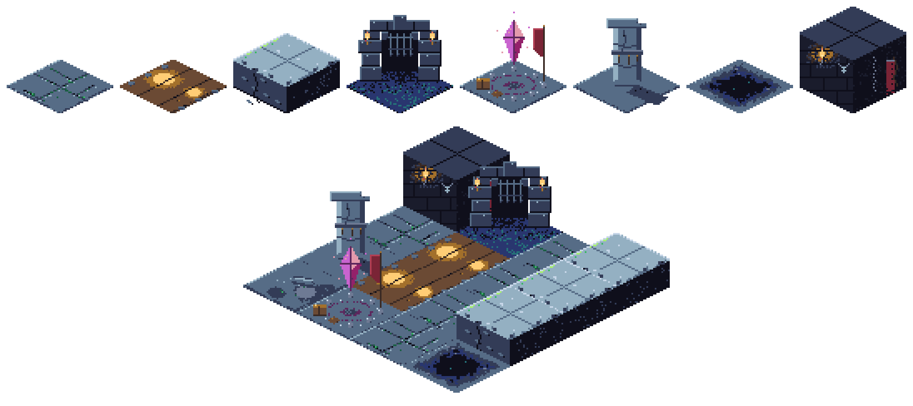


## 6. The heroes — ten operators, five classes

5 female / 5 male, one pair per class; class color families as in §3. Ids are stable engine ids; display names are data.

### Garrick Vael — the Line Unbroken
**vanguard_1 · human · male · Vanguard / veteran banner-sergeant · DP 8 · HP 120 · ATK 6**

Garrick has walked point on more delves than anyone in the Emberwatch can count, and the scar through his brow is the receipt. He was holding lane mouths in torchlit halls back when half the roster was still learning which end of a spear bites, and he treats every corridor the same way: plant the banner, level the spear, and let what crawls up from below break itself on the line. He speaks in short sentences, wastes nothing, and remembers every rookie's name by the second day.

On the board he is the classic opening vanguard — cheap to field, quick to pay for himself, a stubborn body at the choke while the expensive heroes wake up. His banner is not decoration: where it stands, the line stands, and the company's coin flows. Stoic, grounded, first in and last out.

- **Identity kit:** copper practical crop (BRONZE/BROWN) + knotted leaf-green headband; boiled-leather cuirass over slate mail, one battered steel pauldron; boar spear + company banner (deep-green field #1a5f43, lime chevron #a7f070); single leaf-green accent on leather/steel neutrals; scar through left brow.
- **Key art pose:** braced low forward lunge — spear leveled one-handed at the viewer, other arm slamming the banner pole butt-first into cracked flagstone behind him, banner snapping taut overhead, mid-shout, torchlit from below-left.
- **Iso sprite:** flying green banner one tile overhead is the read; copper hair block with 1px green headband; single clean spear diagonal; leather collapses to one BROWN mass.
- **gpt-image-2 prompt:**
```
Full-body anime key art of Garrick Vael, a weathered human male vanguard sergeant in his late thirties from a torchlit dungeon-delving company. Short practical copper crop hair (#a3702b with #6b4a34 shadows), knotted leaf-green headband, pale scar seam through his left eyebrow, stern stoic squint. Boiled brown leather cuirass (#6b4a34, #3a2a24 shadows) over a slate-gray mail shirt (#566c86, #94b0c2 highlights), one dented steel pauldron on the left shoulder, wrapped shins and worn boots. Dynamic braced lunge: front knee bent deep, rear leg locked straight behind, a boar spear with a #94b0c2 steel head leveled one-handed toward the lower left, his right arm slamming a troop banner pole butt-first into cracked stone behind him — the banner a deep green field (#1a5f43, #38b764) with a bright lime chevron (#a7f070), cloth snapping taut above his head. Mid-shout expression, warm torchlight from below-left with cool #333c57 shadow side, gold rim light (#ffcd75) on the spearhead and pauldron edge. Single leaf-green accent color on an otherwise leather-and-steel palette, no pure white, no sky blue. Clean anime key art, cel shading, dynamic action pose, full body, transparent background.
```

| Key art | Iso battle sprite |
|---|---|
| 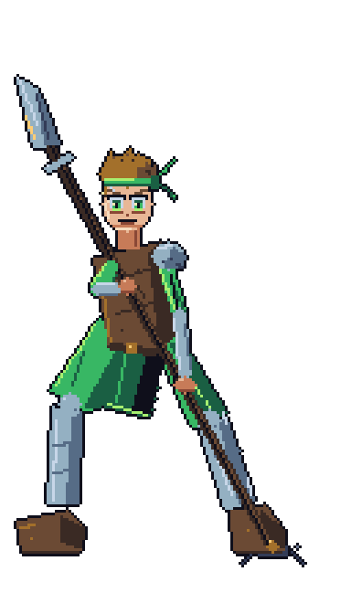 | 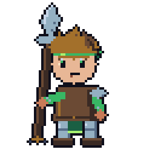 |

---

### Juna Farrow — Dawnbanner
**vanguard_2 · human · female · Vanguard / rookie standard-bearer · DP 10 · HP 135 · ATK 7**

Juna signed the Emberwatch roster the day she was old enough to hold a pole, and she has treated every delve since like the best day of her life. She is the company's newest standard-bearer — the kid who sprints ahead to plant the sunburst where the veterans said the line should be, grinning the whole way down the dark. The old hands pretend she is reckless; they also notice the line always forms exactly where her banner lands.

Mechanically she is the second-wave vanguard: a little dearer than Garrick, a little tougher, arriving as the push develops. Her spear-tipped standard means she never has to choose between carrying the flag and fighting under it. Plucky, loud, impossible to discourage; the torchlight seems brighter in whatever hall she is holding.

- **Identity kit:** high blond ponytail (GOLD/PALE_GOLD, BRONZE shadow); leaf-green tabard over light steel scale; fingerless gloves, scuffed knee guards; signature prop: spear-tipped standard — green field, gold sunburst, gold fringe; leaf-green primary accent, gold secondary confined to hair/sunburst/fringe.
- **Key art pose:** full-sprint vault over a fallen pillar, mid-air — knee tucked, trailing leg kicked back, standard couched low across her hip like a lance with the banner streaming a full body-length behind, ponytail whipped the opposite way, huge grin.
- **Iso sprite:** crossing diagonals of ponytail vs. banner are the read; gold sunburst survives as a 3px GOLD dot on the green flag; green tabard over STEEL torso; grin kept as a 2px curve.
- **gpt-image-2 prompt:**
```
Full-body anime key art of Juna Farrow, a plucky teenage human female standard-bearer from a torchlit dungeon-delving company. High blond ponytail (#ffcd75 with #ffe9b0 highlights and #a3702b shadow) whipping behind her, big bright confident grin, light freckles. Leaf-green cloth tabard (#38b764 with #1a5f43 shadows) belted over a light gray scale-mail shirt (#566c86, #94b0c2 highlights), fingerless leather gloves, scuffed knee guards and boots. Dynamic mid-air vault over a broken stone pillar: leading knee tucked high, trailing leg kicked straight back, both hands couching a spear-tipped standard pole low across her hip like a lance — the banner a green field (#38b764, #1a5f43) with a gold sunburst sigil (#ffcd75) and gold fringe (#ffe9b0), streaming horizontally behind her the full length of her body. Ponytail flung the opposite direction for a crossing silhouette, warm torch glow from the lower right, cool #333c57 shadows. Leaf-green primary accent with gold secondary accent limited to hair, sunburst, and fringe; no pure white, no sky blue. Clean anime key art, cel shading, dynamic action pose, full body, transparent background.
```

| Key art | Iso battle sprite |
|---|---|
| 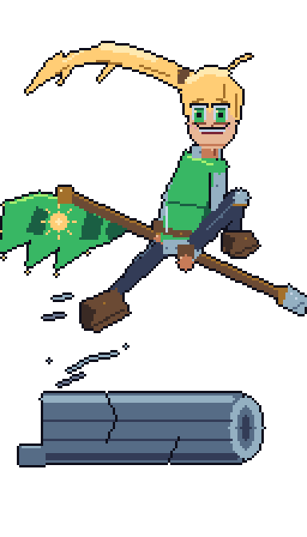 | 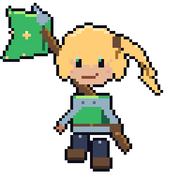 |

---

### Dagr Vosk — the Grinning Edge
**guard_1 · human · male · Guard / sellsword · DP 12 · HP 150 · ATK 10**

Dagr fights for coin, keeps exactly none of it, and would honestly pay the Emberwatch for the privilege if anyone called his bluff. He came up through surface pit-fights swinging a blade too big for the ring, and the dungeon suits him better: longer odds, uglier opponents, nobody complaining about property damage. The fang-toothed grin is permanent — the deeper the delve goes wrong, the wider it gets.

On the board he is the damage half of a hold: drop him behind a vanguard's block and his cleaver turns a stalled lane into a kill zone. He is loud, insufferable, and completely reliable in the only way that matters — he has never once left a line he was paid to stand on. The veterans roll their eyes at him and always, always put him next to the rookies.

- **Identity kit:** wild spiky silver-white hair (PALE, never pure white); open leather coat with crimson lining, bandaged sword arm, one steel shoulder plate; crimson sash knotted at the hip; signature prop: huge nicked single-edged greatsword with WINE-wrapped grip; fire-crimson accent on leather/steel neutrals.
- **Key art pose:** airborne falling cleave — mid-leap corkscrew, both hands dragging the greatsword through a downward diagonal that trails a crimson-to-gold ember arc, coat and sash flared wide, fanged grin, one eye squinted.
- **Iso sprite:** PALE spike-hair mass + oversized cleaver slab across the shoulder are the read; crimson sash as a single 1px CRIMSON waist band; fang grin kept as a 2px asymmetric mouth.
- **gpt-image-2 prompt:**
```
Full-body anime key art of Dagr Vosk, a cocky human male sellsword from a torchlit dungeon-delving company. Wild spiky silver-white hair (#c7d6e8 with #94b0c2 shadows), sharp fang-baring grin, one eye squinted in glee. Open scuffed brown leather coat (#6b4a34, #3a2a24 shadows) with a crimson inner lining (#b13e53), bandage-wrapped sword arm, single asymmetric steel shoulder plate (#94b0c2), long crimson sash (#b13e53 with #7a2436 shadows) knotted at his hip and flaring in the wind. Dynamic airborne attack: caught mid-leap at the apex, torso corkscrewed, both hands hauling a huge nicked single-edged greatsword (#566c86 blade, #94b0c2 edge highlight, #7a2436 wrapped grip) through a downward diagonal cleave that trails a sweeping ember arc of #b13e53 to #ef7d57 to #ffcd75 across the frame. Coat tails and sash flared wide, knees tucked, boots off the ground. Warm torchlight from below with cool #333c57 shadow planes, fire-crimson accent family on a leather-and-steel base; silver-white hair must not be pure white, no #f4f4f4, no sky blue. Clean anime key art, cel shading, dynamic action pose, full body, transparent background.
```

| Key art | Iso battle sprite |
|---|---|
| 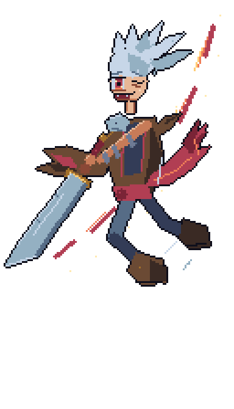 | 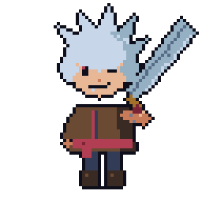 |

---

### Vessaryn Thal — the Wine-Dark Waltz
**guard_2 · dark elf · female · Guard / blade-dancer · DP 16 · HP 185 · ATK 15**

Vessaryn danced for a sunken court that no longer exists, in halls that are now three levels below the Emberwatch's deepest map. She does not talk about it. She joined the company the night something wearing her old court's livery crawled up a stairwell, and she has been cutting her way back down ever since — unhurried, immaculate, keeping a professional distance from everyone except whatever is at the end of her blades. The gold ear stud is the only piece of the old court she kept.

In play she is the premium guard: expensive, late, decisive. Where Dagr grinds a lane down, Vessaryn ends specific problems — the armored thing, the fast thing, the thing the sniper cannot crack — in two crossing strokes. Cold elegance as a combat stat; the dance never changes tempo, the enemies simply stop being in it.

- **Identity kit:** ink-black hime cut (VOID with DUSK sheen) framing long pointed ears and ash-gray skin; single gold ear stud; fitted wine silk bodysuit with crimson panels, gold piping and waist cord, dark leather articulation; signature prop: twin curved single-edged blades with gold ring pommels; wine-crimson body, gold strictly rationed.
- **Key art pose:** low killing pirouette — coiled on one pointed foot, other leg swept full-extension off the floor, one blade reversed along the forearm, the other arced overhead, wine-red afterimage circles around her, cold glance back over the shoulder.
- **Iso sprite:** hime-cut black hair silhouette with square sidelocks + 2px ear points are the read; WINE bodysuit with 1px GOLD cord; two 1px curved STEEL blade glints; the ear stud is exactly one GOLD pixel.
- **gpt-image-2 prompt:**
```
Full-body anime key art of Vessaryn Thal, an elegant female dark elf blade-dancer from a torchlit dungeon-delving company. Ink-black hime cut hairstyle — blunt straight bangs, sharp cheek-length sidelocks, long straight back hair (#0f0f1b with #333c57 sheen) — long pointed elf ears, cool ash-gray skin (#6e7a94 shadow tones with lighter slate highlights), muted rose lips (#e39aac), narrow unimpressed crimson eyes, one small gold ear stud (#ffcd75). Fitted wine-dark blade-dancer armor: deep wine silk bodysuit (#7a2436) with crimson panels (#b13e53), thin gold piping, a knotted gold waist cord, dark leather articulation at shoulders and thighs, bare upper arms. Dynamic low pirouette: balanced coiled on the ball of one pointed foot, the other leg swept out in full extension just off the floor, one twin curved blade held reversed-grip flat along her forearm, the other arm arced overhead with its blade horizontal — both steel edges (#94b0c2, #c7d6e8 highlights) trailing thin wine-red afterimage arcs (#7a2436 to #b13e53) circling her body. Hime cut fanned outward by the spin, glancing back over her shoulder with cold elegance. Cool torchlit rim light, wine-crimson accent family with strictly rationed gold; no pure white, no sky blue. Clean anime key art, cel shading, dynamic action pose, full body, transparent background.
```

| Key art | Iso battle sprite |
|---|---|
| 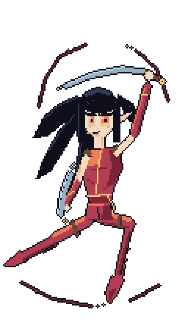 | 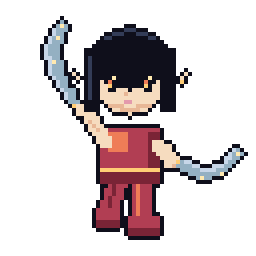 |

---

### Odgar Hallanchor — the Door That Holds
**defender_1 · dwarf · male · Defender / shield-warden · DP 16 · HP 200 · ATK 8 · Block 3**

Odgar was a gate-warden in the deep-holds before the deep-holds went quiet, and he brought the gate with him — or near enough: a tower shield the size of a cellar door, storm-teal enamel, lantern sigil, older than most of the company. He is the Emberwatch's gentle giant: braids the rookies' rope, remembers everyone's tea, apologizes to the things he flattens. But when he plants that shield across a corridor, the corridor is over. Three abreast can hit him at once; he holds the door and hums.

On the board he is the anchor defender — the highest-value block in the roster, the piece you build a killbox around. His mace is an afterthought; his real weapon is that nothing gets past him while the snipers and casters do arithmetic over his shoulder. Where Odgar stands, the map has a wall.

- **Identity kit:** steel skullcap with dented rim; enormous chestnut braided beard with a single gold clasp (half his silhouette); full plate over chain; signature prop: door-sized tower shield, storm-teal enamel (#257179/#29366f) with pale-cyan lantern emblem (#73eff7), plus a short flanged mace; storm-teal accent, one gold clasp.
- **Key art pose:** impact brace at the moment of collision — side-on, shoulder and cheek into the angled shield, front knee sunk, rear boot plowing sparks and gravel behind him, mace relaxed behind the shield, calm gentle smile over the rim.
- **Iso sprite:** the TEAL shield slab with a 3-4px CYAN lantern emblem is the read; BROWN beard mass over the rim with one GOLD clasp pixel; STEEL skullcap glint; eyes-over-the-rim face; shield must never drift toward probe SKY blue.
- **gpt-image-2 prompt:**
```
Full-body anime key art of Odgar Hallanchor, a gentle-giant male dwarf shield-warden from a torchlit dungeon-delving company. Squat and immensely broad, weathered kind face with laugh lines, calm gentle smile, polished steel skullcap (#94b0c2 with #c7d6e8 glint, dented rim), enormous chestnut-brown beard (#6b4a34 with #a3702b highlights) woven into one great braid cinched by a bright gold clasp (#ffcd75). Full steel plate armor over chainmail (#566c86, #94b0c2 highlights, #333c57 shadows), moss-scuffed boots. Dynamic impact brace at the moment of a monstrous unseen collision: body side-on, shoulder and cheek pressed into the inner face of a door-sized tower shield angled toward the lower left — its face enameled storm-teal (#257179 over #29366f) with a pale-cyan lantern emblem (#73eff7) — front knee sunk deep, rear leg driven out long behind him, boot plowing a skid of sparks (#ffcd75, #ef7d57) and gravel off the stone floor, a short flanged steel mace held low and relaxed in his free hand behind the shield. Warm torchlight raking the shield face, cool #333c57 shadows behind him. Storm-teal accent family on steel and beard-brown, one gold clasp accent; no pure white, no sky blue #41a6f6 — the emblem cyan is #73eff7. Clean anime key art, cel shading, dynamic action pose, full body, transparent background.
```

| Key art | Iso battle sprite |
|---|---|
| 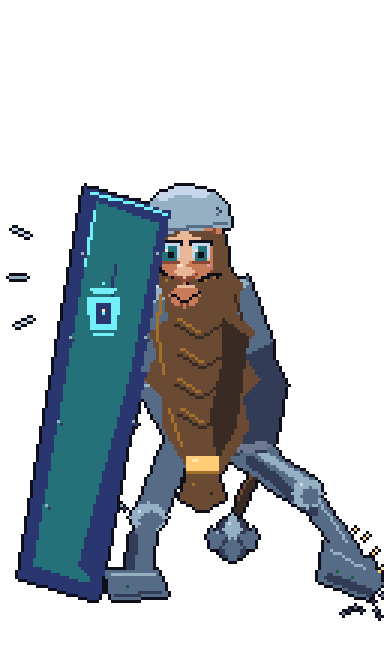 | 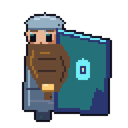 |

---

### Sigrid Valebright — the Unbroken Gate
**defender_2 · human · female · Defender · DP 18 · HP 250 · ATK 9 · Block 3**

Sigrid was a gate-warden of Cragmoor's Ninth Stair — the last landing before the Undervault proper — until the night the Stair fell and she held its broken arch alone until dawn relief came. The Lantern Charter made her epithet official; she considers it a job description. Down in the delves she is where panic goes to die: unhurried, faintly amused, planting her shield at the mouth of a lane the way other people put a kettle on. She braids her hair into a crown each morning because, as she puts it, someone down here should look like the law.

In combat she is the roster's widest wall — three bodies stack against her shield and stay there while the line behind her works. Her hammer is punctuation, not conversation: slow, heavy counters that remind the pinned exactly why they stopped moving. Her instinct is protective to a fault; playtests should feel her as the calm center every other unit is deployed around.

- **Identity kit:** Gold crown-braid coiled around the head (GOLD #ffcd75 / BRONZE #a3702b / PALE_GOLD #ffe9b0) — the signature silhouette; worn full plate on the steel ramp (SLATE #566c86, STEEL #94b0c2, PALE #c7d6e8) with boiled-leather straps; storm-teal tabard (TEAL #257179 over NAVY #29366f); signature prop: tall kite shield, NAVY field with glowing CYAN #73eff7 gate-and-wave sigil, paired warhammer with bronze head. Accents: gold braid/trim primary, cyan sigil-glow secondary.
- **Key art pose:** Wide braced stance, kite shield just slammed point-first into cracking flagstones, warhammer cocked back over the shoulder mid-backswing, tabard whipping forward from the impact, chin up, proud half-smile.
- **Iso sprite:** Shield held big and flat toward the lane (~40% of sprite front), hammer over the far shoulder. Survives at 64px: gold braid-ring on the head, NAVY shield slab with a 2-3px CYAN sigil dot, teal tabard stripe, steel-gray mass.
- **gpt-image-2 prompt:**
```
Full-body fantasy anime key art of Sigrid Valebright, a proud human woman paladin defender in a torchlit dungeon-delve world. Golden blonde hair #ffcd75 woven into a thick braid coiled around her head like a crown, shaded #a3702b with #ffe9b0 highlights; warm confident face, amber eyes. She wears worn full plate armor in cool blue-gray steel #566c86 and #94b0c2 with pale edge light #c7d6e8 and dark seams #333c57, under a storm-teal knight's tabard #257179 with deep navy shadow #29366f and gold trim #ffcd75. Dynamic pose: knees bent in a wide braced stance, she slams a tall kite shield point-first into cracking stone flagstones — the shield has a deep navy #29366f field bearing a glowing cyan #73eff7 gate-and-wave sigil — while her other arm cocks a bronze-headed warhammer #a3702b back over her shoulder, tabard snapping forward from the impact, chin raised, proud half-smile. Boiled leather straps #6b4a34, cold stone dungeon mood, single cyan magic accent glow. Deepest shadows #0f0f1b, no pure white (use #c7d6e8 and #ffe9b0 for highlights instead). Clean anime key art, cel shading, dynamic action pose, full body, transparent background.
```

| Key art | Iso battle sprite |
|---|---|
| 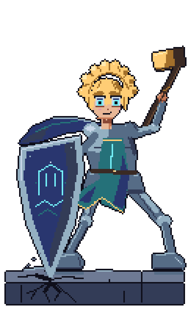 | 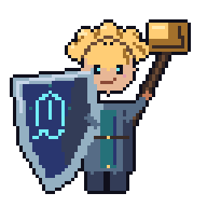 |

---

### Rennick Thorne — the Quiet Ledger
**sniper_1 · human · male · Sniper · DP 10 · HP 100 · ATK 10**

Rennick keeps a ledger. Every bolt he looses in the Undervault has a line in it — target, distance, fee — because he was a caravan-debt enforcer topside before the Lantern Charter offered better money for worse company, and old habits survive career changes. He is the delve team's professional: punctual, laconic, contemptuous of heroics, privately incapable of leaving a contract unfinished. Rookies find him cold until the day something fast comes out of the dark and dies eight meters short of them with gold fletching in its eye.

On the board he is the cheap, reliable backbone of ranged damage — deploy early, tuck him behind the wall, and let the windlass crossbow do its grim arithmetic. Slow, heavy, single-target shots that punch through armor rather than shower sparks; his gameplay feel is a metronome, and his art should feel the same: drab, exact, one glint of gold per beat.

- **Identity kit:** Dark hair (INK #1a1c2c) slicked hard back into a short low tail — clean skull silhouette; long UMBER #3a2a24 duster over BROWN #6b4a34 boiled-leather jerkin and bracers with BRONZE #a3702b fittings; signature prop: heavy steel-limbed windlass crossbow, dark stock, bronze crank; thigh quiver of GOLD #ffcd75-fletched bolts. Accent: gold only — fletching, buckle glints, tally rings.
- **Key art pose:** Combat slide onto one knee across dungeon grit, coat flaring in a long diagonal, crossbow leveled and locked to his cheek, off-hand finishing the windlass crank, a spent bolt spinning in the air beside him.
- **Iso sprite:** Kneeling, crossbow held horizontal toward the lane — the T-silhouette across the body is the read. Survives at 64px: dark slicked head, umber coat wedge behind the knee, horizontal crossbow bar with a gold fletching dot.
- **gpt-image-2 prompt:**
```
Full-body fantasy anime key art of Rennick Thorne, a cool professional human male mercenary marksman in a torchlit dungeon-delve world. Dark hair #1a1c2c slicked straight back into a short low tail, sharp jaw, flat unhurried eyes, faint stubble. He wears a long weathered duster coat in dark umber #3a2a24 over a boiled-leather jerkin and bracers #6b4a34, with bronze buckles and fittings #a3702b and deep shadow #0f0f1b in the folds. Dynamic pose: mid combat-slide onto one knee across gritty dungeon stone, coat flaring out behind him in a long diagonal, a heavy steel-limbed windlass crossbow with dark wood stock and bronze crank #a3702b already leveled and locked against his cheek, off-hand finishing the crank, a spent bolt spinning in the air beside him; thigh quiver of bolts fletched in gold #ffcd75, the only bright color on him. Warm torchlight rim, muted earth palette #3a2a24 #6b4a34 #a3702b with gold #ffcd75 accents only, skin tones #c77b58 and #e8b796, no pure white. Clean anime key art, cel shading, dynamic action pose, full body, transparent background.
```

| Key art | Iso battle sprite |
|---|---|
| 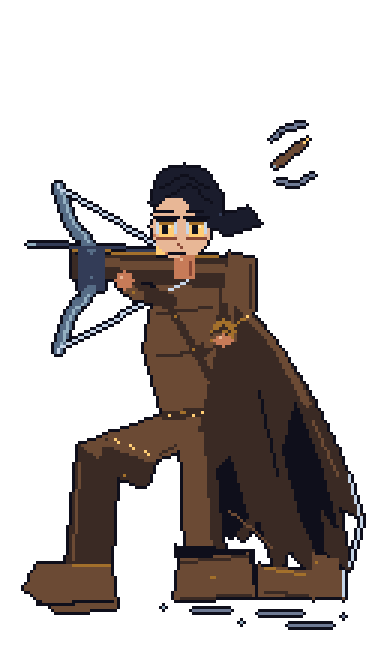 | 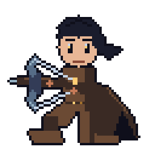 |

---

### Liriel Vess — the Pale Hawk
**sniper_2 · elf · female · Sniper · DP 14 · HP 115 · ATK 14**

The elves of the Vess line once kept hawks above the canopy; Liriel keeps herself instead, perched on whatever broken architrave the Undervault offers, watching lanes the way raptors watch field-mice. She came down into the dark on a private grief she has never priced for anyone — something the Undervault took from her people — and she hunts it delve by delve with the unnerving patience of a creature that measures time in centuries. Among the company she is courteous, quiet, faintly amused by human urgency, and the only one Rennick Thorne has ever called a better shot than himself, in writing, in the ledger.

Mechanically she is the premium arrow: higher cost than the crossbowman, faster and harder-hitting, the answer to drones and fliers and anything that thinks the back line is safe. Her visual job in the roster is contrast — the palest values in the cast, moonlight against torchlight, so that even at 64 pixels the eye finds her first and the gold of her eye and bow-tips does the rest.

- **Identity kit:** Long white hair in PALE #c7d6e8 shaded STEEL #94b0c2 (never probe-white #f4f4f4) with a hawk-wing fringe over the left eye; long pointed ears; PALE_GOLD #ffe9b0 tunic, PALE leggings, UMBER #3a2a24 boots, BROWN #6b4a34 bracer; signature prop: pale recurve longbow with GOLD #ffcd75 limb-tips and BRONZE #a3702b riser. Accents: gold — the one visible eye, hip sash, bow tips.
- **Key art pose:** Backwards leap off a crumbling ledge, hanging at the apex, body arced and torso twisted toward the target below, longbow at full draw past her ear, hair and gold sash streaming upward, single gold eye sighting down the arrow.
- **Iso sprite:** Quarter-turn full draw toward the lane. Survives at 64px: the pale hair mass (brightest on the board) with a diagonal fringe notch, ear tips, tall bow arc with gold tip pixels, gold sash dot.
- **gpt-image-2 prompt:**
```
Full-body fantasy anime key art of Liriel Vess, an elegant elf woman sharpshooter in a torchlit dungeon-delve world, the palest figure in her company. Very long white hair rendered in pale blue-white #c7d6e8 with cool shading #94b0c2 (not pure white), a sharp hawk-wing fringe swept over her left eye, long pointed elf ears cutting through the hair, one visible piercing gold eye #ffcd75, light skin #f6dcbf shaded #e8b796. Fitted pale huntress garb: pale gold tunic #ffe9b0 over pale leggings #c7d6e8, dark umber boots #3a2a24, leather bracer #6b4a34, a knotted gold sash #ffcd75 at her hip. Dynamic pose: she has kicked backwards off a crumbling stone ledge and hangs at the apex of the fall, body arced, torso twisted back toward a target below, an elegant recurve longbow of pale limewood with gold lacquered limb-tips #ffcd75 and bronze riser #a3702b at full draw past her ear, arrow sighted along the single gold eye; hair and sash streaming upward, legs scissored, toes pointed. Cool moonlit values against warm dungeon dark #0f0f1b, gold accents only, no pure white #f4f4f4 anywhere. Clean anime key art, cel shading, dynamic action pose, full body, transparent background.
```

| Key art | Iso battle sprite |
|---|---|
| 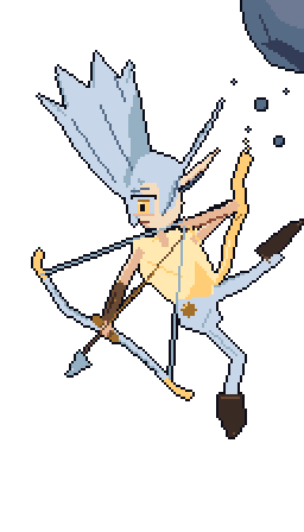 | 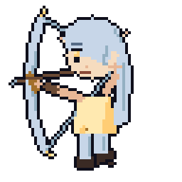 |

---

### Maribel Cindervein — the Hearthflame Witch
**caster_1 · hornblood · female · Caster · DP 16 · HP 90 · ATK 9**

Hornbloods carry an old bargain in their veins — a coal of the First Hearth, the story goes, that keeps them warm in the deep places and marks them with small gold horns so nobody forgets the debt. Maribel wears hers like jewelry. She grew up the hedge-witch's kid in a village above the Cragmoor delves, mending kettles and scaring wolves with sparks, until a Lantern Charter recruiter watched her casually re-light a rain-killed watchfire from thirty paces and tore up his quota sheet. She descends into the Undervault the way other people come home: shrugging off her pack, planting her staff, remarking that the place could really use a fire. She is the company's warmth in every sense — first to laugh, first to share rations, and the one who sits with rookies after their first bad delve. The grin is genuine. So is the witch behind it: Maribel reads a lane the way a baker reads an oven, and her patience with things that hurt her friends is precisely zero.

In combat she is the canon splash caster — the reason the caster class family is orchid and the reason the tutorial teaches area damage. Her hearthflame doesn't lance, it *blooms*: slow gouts that catch groups at the lane mouth and cook everything the wall is holding. Expensive to field, fragile if reached, devastating behind Sigrid's shield — the pilot pairing every player learns first. Her ember-tipped staff is the visual anchor of the whole roster style guide: dark D&D materials (gnarled wood, bronze cage, cold stone) carrying one living anime-bright flame. Every effect she owns runs the fire ramp WINE→CRIMSON→CORAL→GOLD→PALE_GOLD, and her sprite's ember pixel doubles as the class-identifying read at gameplay zoom.

- **Identity kit:** Big wavy coral hair (CORAL #ef7d57 / CRIMSON #b13e53 / GOLD #ffcd75 crests) with a springy ahoge; small curved gold horns (GOLD #ffcd75, BRONZE #a3702b roots); layered orchid robe (ORCHID #c964cf, PLUM #5d275d, MAGENTA #94216a) with gold trim and WINE #7a2436 underskirt, scuffed BROWN #6b4a34 boots; signature prop: gnarled UMBER #3a2a24 staff with a bronze-caged living ember breathing CORAL→GOLD→PALE_GOLD #ffe9b0. Accents: the fire family over the orchid base; ROSE #e39aac freckles/blush.
- **Key art pose:** Peak of a casting twirl — pivoting on one toe, other foot kicked up, skirt and hair fanning in a spiral, staff swept in a wide arc trailing an ember ribbon around her body, free hand cupping a fireball that underlights her grin and horns, ahoge whipping opposite the spin.
- **Iso sprite:** Mid-cast, staff planted diagonally, ember-cage tip high on the lane side, free hand sparking. Survives at 64px: coral hair blob + ahoge tick, gold horn pixels breaking the outline, orchid bell robe (only orchid mass on the board), bright ember dot at the staff tip.
- **gpt-image-2 prompt:**
```
Full-body fantasy anime key art of Maribel Cindervein, a warm cheerful hornblood sorceress — a young witch with two small curved gold horns #ffcd75 with bronze roots #a3702b sweeping back from her hairline — in a torchlit dungeon-delve world. Big buoyant waist-length wavy coral hair #ef7d57 shaded #b13e53 with gold #ffcd75 crest highlights and one springy ahoge on top; round face, big amber eyes, rose freckles and blush #e39aac, wide crooked grin. She wears a layered orchid witch-robe #c964cf with deep plum folds #5d275d and magenta mid-tones #94216a, gold trim #ffcd75 at hem and cuffs, a wine underskirt #7a2436, scuffed brown travel boots #6b4a34. Dynamic pose: caught at the peak of a casting twirl, pivoting on one boot toe with the other foot kicked up behind her, skirt and coral hair fanning out in a spiral, a gnarled dark-wood staff #3a2a24 taller than she is swept in a wide horizontal arc, its bronze-caged tip trailing a ribbon of embers in #ef7d57 #ffcd75 #ffe9b0 that curls around her body, while her free hand cups a just-bloomed fireball close to her grinning face, warm underlight on cheeks and gold horns, ahoge whipping opposite the spin. Deep shadow #0f0f1b, warm ember glow against cold dungeon stone, no pure white — hottest highlight is pale gold #ffe9b0. Clean anime key art, cel shading, dynamic action pose, full body, transparent background.
```

| Key art | Iso battle sprite |
|---|---|
| 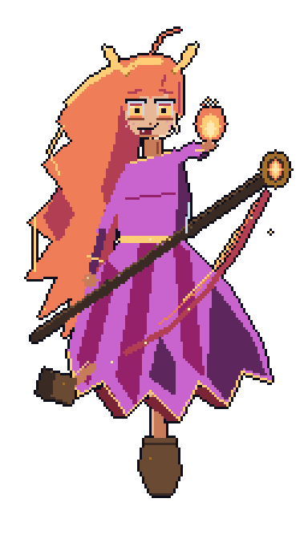 |  |

---

### Severin Thal — the Cold Front
**caster_2 · human · male · Caster · DP 20 · HP 100 · ATK 12**

The Cragmoor Collegium expelled Severin Thal for 'temperamental unsuitability to collaborative scholarship,' which he has the letter framed to prove. His thesis — that the Undervault's dead levels still carry charge, that the whole ruin is a vast discharged storm waiting to be re-billed — was sound; his habit of demonstrating it on his examiners was not. The Lantern Charter took him because the Charter takes anyone whose math works. He walks the delves like a man auditing them: bored, precise, narrating enemy mistakes in a flat murmur while his orb — a bottled stormfront he refuses to explain — orbits him like a moon that has learned to heel. The tome computes; the orb executes; Severin, as far as anyone can tell, merely approves.

In combat he is the expensive scalpel to Maribel's oven: the roster's premier single-target burst, arcing executioner bolts into whatever elite the wall is straining against. His whole visual grammar is restraint versus discharge — a dark plum column of a man, nearly motionless, and then one small two-fingered gesture buys a lane-splitting flash of cyan. Where every other hero's action pose spends the body, Severin's spends the world around the body: robes, pages, and lightning move violently so he doesn't have to.

- **Identity kit:** Cyan asymmetric undercut (CYAN #73eff7 over TEAL #257179, buzzed left side) — hard diagonal silhouette; long high-collared PLUM #5d275d robe with NAVY #29366f shadow and jagged TEAL lightning-trim flickering CYAN at the tips; DUSK #333c57 gloves/boots; signature props: floating lightning orb (NAVY core, CYAN arcs) plus an iron-clasped floating tome with STEEL #94b0c2 / SLATE #566c86 fittings. Accent: cyan only.
- **Key art pose:** Relaxed contrapposto slouch, one hand pocketed, the other raised with two fingers extended in a small dismissive gesture as the orbiting orb detonates a massive bolt off-frame — robe and hair blasted sideways by static wind, tome pages fanning, expression unmoved.
- **Iso sprite:** Narrow upright column, two fingers raised toward the lane. Survives at 64px: cyan diagonal hair wedge, the 3-4px cyan orb with navy center floating clear of the silhouette (his class read and attack anchor), dark plum robe column with 1px teal hem ticks, 2px steel tome slab.
- **gpt-image-2 prompt:**
```
Full-body fantasy anime key art of Severin Thal, an aloof human male storm sage in a torchlit dungeon-delve world. Bright cyan hair #73eff7 shaded teal #257179 in a severe asymmetric undercut — long sweep across the right side, buzzed short on the left — half-lidded pale eyes, permanently unimpressed expression, skin #c77b58 with #e8b796 light. He wears a long high-collared scholar's robe in dark plum #5d275d with navy shadow #29366f, its hems and seams stitched with jagged teal lightning-trim #257179 flickering cyan #73eff7 at the tips, dusk-gray gloves and boots #333c57. Dynamic pose: he stands perfectly relaxed in a contrapposto slouch, one hand loosely in a robe pocket, the other raised shoulder-high with two fingers extended in a small dismissive gesture — and at that gesture a floating lightning orb with a navy #29366f core wrapped in crackling cyan #73eff7 arcs, orbiting above his shoulder, detonates a massive lightning bolt off-frame; his robe and hair are blasted sideways by static wind while a heavy iron-clasped tome with steel fittings #94b0c2 #566c86 floats open at his hip, pages fanning wildly. Cold blue rim light against warm dungeon dark #0f0f1b, cyan accents only, no pure white #f4f4f4 — brightest light is cyan #73eff7. Clean anime key art, cel shading, dynamic action pose, full body, transparent background.
```

| Key art | Iso battle sprite |
|---|---|
| 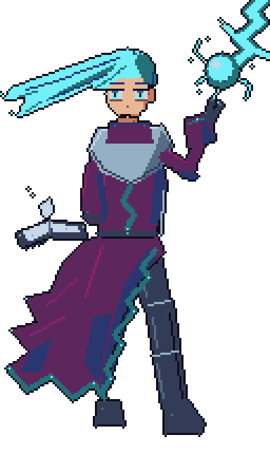 | 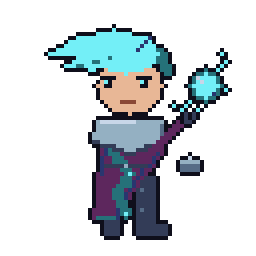 |


## 7. The enemies — what crawls up from below

Enemies live cold and desaturated with one hostile accent, so heroes always read warmer and cleaner than what they fight (temperature is team-read law).

### Snik — Tunnel-Rat of the Under-Warrens
**runner · Kobold · Male · Skirmisher (fast lane runner) · HP 25 · ATK 4 · fast move**

Snik was the runt of a warren that measured worth in stolen candles, and he survived it by being faster than blame. When the deep halls stirred and the marching hordes needed scouts, the kobolds shoved their runts out front — Snik just never stopped running. He isn't brave; he is committed. Somewhere behind that needle-toothed grin is the honest arithmetic of a creature who knows the heroes' blades are slow and the base gate is close.

On the board he is the tempo check: the first thing down every lane and the punishment for a late deploy. He dies to almost anything that touches him, but anything that doesn't touch him costs the player a base heart. His whole visual identity is built to telegraph that — a low, horizontal streak of earth-brown topped with one screaming crimson hood, a red dart skittering across cold stone.

- **Identity kit:** no hair — ragged CRIMSON #b13e53 hood (torn, one notched ear through a hole) over BROWN #6b4a34 scaly hide with UMBER #3a2a24 shadow / BRONZE #a3702b highlight; UMBER scrap-leather harness, bronze buckle bits, bare claws, ringed tail; signature prop: rusty BRONZE dagger, reverse grip; accent: the crimson hood, nothing else loud.
- **Key art pose:** full sprint mid-leap over a broken flagstone — body horizontal, legs kicked back, tail streaming, dagger reversed at the hip, free claw raking forward, gleeful panicked cackle.
- **Iso sprite:** mid-sprint stride, torso pitched forward, trailing tail line; at 64px the read is CRIMSON hood blob + BROWN body streak + 2px BRONZE dagger. Smallest, lowest silhouette in the roster.
- **gpt-image-2 prompt:**

```
Full-body dark fantasy anime key art of Snik the kobold skirmisher, a tiny wiry reptilian dungeon raider sprinting at full tilt, caught mid-leap low to the ground, body horizontal, both legs kicked back, whip-thin tail streaming behind him. He clutches a rusty pitted dagger (corroded bronze #a3702b blade, dark brown #6b4a34 rag-wrapped grip) in a reverse grip at his hip, free claw raking forward. Scaly hide in warm browns (#6b4a34 base, #3a2a24 shadows, #a3702b highlights), one long notched ear poking through a hole in his ragged torn crimson #b13e53 hood — the hood is the single strong accent color. Scrap-leather harness in dark umber #3a2a24 with small bronze buckles, bare clawed feet. Needle-toothed gleeful grin, one wide expressive gold #ffcd75 eye. Torchlight rim-lighting in warm gold #ffcd75, deep shadows in near-black #0f0f1b, moody dungeon-delve grit with gacha-anime charm. dark fantasy anime key art, cel shading, dynamic action pose, full body, transparent background
```

| Key art | Iso battle sprite |
|---|---|
| 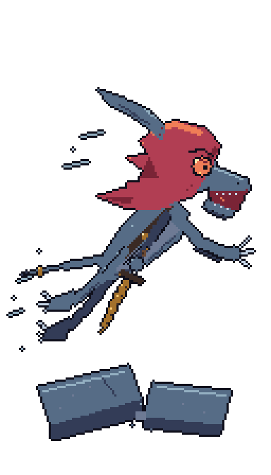 | 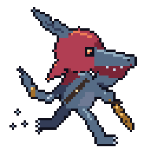 |

---

### Gnarl — Spearline of the Ninth Warren
**grunt · Goblin · Male · Raider (melee fodder) · HP 40 · ATK 5**

Gnarl is the ninth goblin of the ninth file of the Ninth Warren, and he has the plank shield to prove it — every dent a story, every bite mark his own (rations were short). Goblin raiders don't march for glory; they march because the thing behind them in the dark is worse than the heroes in front. Gnarl has made an uneasy peace with this and channels it into professional-grade snarling and a genuinely respectable spear thrust.

He is the game's unit of account: one Gnarl is what one blocker comfortably kills, so the designer speaks in Gnarls-per-second and the player learns to read waves by counting his ears over the shield rims. His kit is deliberately generic-with-one-hook — mud-brown leathers and plank wood that vanish into the dungeon, green skin and bat-wing ears that pop out of it, one gold ring so your eye has somewhere to land.

- **Identity kit:** bald GREEN #38b764 scalp (DEEP_GREEN #1a5f43 shade, LIME #a7f070 light), huge bat-wing ears, one GOLD #ffcd75 ear-ring (sole accent); BROWN #6b4a34 patchwork boiled-leather jerkin, UMBER #3a2a24 straps, one salvaged SLATE #566c86 shoulder plate; signature props: crude spear (brown haft, slate head) + bitten plank shield with BRONZE studs.
- **Key art pose:** committed charging thrust — plank shield up to eye level, ears and glare over the rim, spear couched low and driving, back leg braced.
- **Iso sprite:** mid-stride lane walk, shield squared to the lane, spear over shoulder; at 64px the read is bat-wing ears + green/brown color split + 1px gold ring.
- **gpt-image-2 prompt:**

```
Full-body dark fantasy anime key art of Gnarl the goblin raider, a scrawny hunched green-skinned dungeon soldier charging with weight fully committed. He leads with a crude plank shield — three splintered wooden boards (#6b4a34 wood, #3a2a24 gaps, #a3702b nail studs, a chipped bite mark in the rim) — raised to eye level so only his glaring brow and two huge bat-wing ears show over it, while a crude spear (dark brown #6b4a34 haft, dull slate #566c86 iron head lashed on with cord) is couched low under his arm, driving forward, back leg braced. Mottled goblin skin in green ramp (#38b764 base, #1a5f43 shadows, #a7f070 highlights), bald scalp, snarling underbite with one snaggle tooth, ears pinned back — one ear pierced with a single gold #ffcd75 ring, the only bright accent. Patchwork boiled-leather jerkin in browns (#6b4a34, #3a2a24 straps) with one mismatched slate #566c86 salvaged shoulder plate, wrapped feet. Torchlit dungeon mood, warm gold #ffcd75 rim light against cold stone shadow #0f0f1b, gritty D&D materiality with expressive gacha-anime face. dark fantasy anime key art, cel shading, dynamic action pose, full body, transparent background
```

| Key art | Iso battle sprite |
|---|---|
| 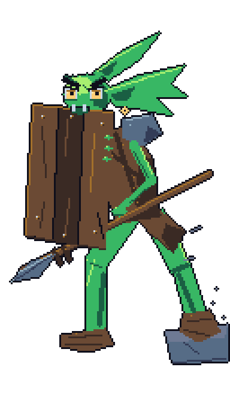 | 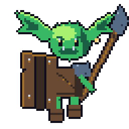 |

---

### Vesper — Acolyte of the Hollow Choir
**spellcaster · Human (cultist) · Female · Acolyte (ranged bolts) · HP 45 · ATK 7 · ranged**

The Hollow Choir found Vesper as a plague orphan singing to keep the dark off, and taught her that the dark sings back if you learn the words. She is unfailingly polite, faintly amused, and entirely certain that feeding the deep halls is a kindness the surface world will thank her for eventually. The wand is a finger of the Choir's first cantor; she talks to it. It answers.

Tactically she is the first enemy that ignores the block line: her orchid bolts arc over the melee and land on the player's deployed heroes, so a wave with Vesper in it converts 'am I blocking?' into 'who kills the caster first?'. Her art enforces the priority read — the whole figure is deep wine-and-plum shadow with exactly one loud element, the spinning arcane sigil, so even at lane distance the player's eye snaps to the purple glow and knows what it means.

- **Identity kit:** deep pointed hood, escaped INK #1a1c2c hair strands over a pale SKIN_PALE #f6dcbf chin, ORCHID #c964cf eye-glows in hood shadow; WINE #7a2436 robes with PLUM #5d275d lining and MAGENTA #94216a rune-stitched hem, umber rope belt; signature prop: PALE #c7d6e8 bone wand with BRONZE ferrule + spinning ORCHID cast-sigil; accent: all glow budget on the arcane orchid/rose magic.
- **Key art pose:** lunging two-handed cast toward the viewer, robes flared, sigil ring blooming off the wand tip, face underlit by her own spell showing only a serene smile.
- **Iso sprite:** lane walk with wand leveled, 3-4px orchid sigil glow leading her; at 64px the read is pointed-hood silhouette + wine robe mass + one saturated purple glow cluster (the 'ranged' tell).
- **gpt-image-2 prompt:**

```
Full-body dark fantasy anime key art of Vesper, a hooded human cultist acolyte of the Hollow Choir, caught mid-cast in a lunging step. Her front foot slides forward, heavy wine-dark robes (#7a2436 outer cloth, #5d275d plum lining, #94216a magenta rune-stitched hem trim, dark umber #3a2a24 rope belt and pouches) flaring back from the motion. Both hands thrust a knobbed bone wand (pale bone #c7d6e8 with a bronze #a3702b ferrule) toward the viewer, and a glowing spinning arcane sigil ring in orchid #c964cf blooms off its tip, trailing rose #e39aac sparks — the sigil is the light source, underlighting her face. Her deep hood hides everything above a serene faintly-smiling mouth and pale chin (#f6dcbf) except two faint orchid #c964cf eye-glows in the shadow; a few loose strands of near-black #1a1c2c hair escape the hood. Matte heavy wool, waxed cord, old bone materials; deep dungeon darkness #0f0f1b pushed back by the purple spell-glow. Menacing yet elegant gacha-anime silhouette. dark fantasy anime key art, cel shading, dynamic action pose, full body, transparent background
```

| Key art | Iso battle sprite |
|---|---|
| 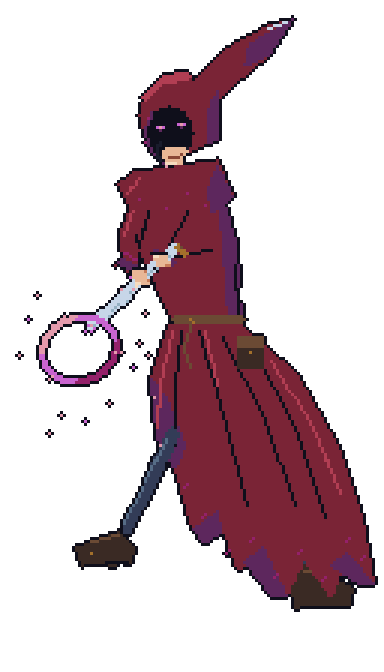 | 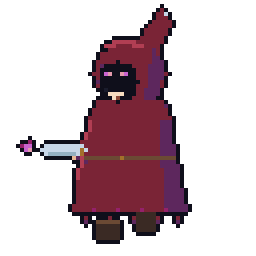 |

---

### The Unblinking — Watcher-Wisp of the Vault Lamps
**drone · Arcane construct · None · Watcher (AERIAL, ranged-immune to charm) · HP 30 · ATK 5 · aerial · charm-immune (no mind to charm)**

Before the deep halls fell, the vault lamps watched the treasuries — iron lanterns ensouled with a single instruction: *observe*. The instruction outlived the empire, the chains, and arguably the concept of treasury. The Unblinking tore loose from its bracket centuries ago and now drifts the lanes still executing its one verb, except that somewhere in the long dark, 'observe' curdled into 'approach', and 'approach' into 'burn what blinks first'. There is no malice in it. There is nothing in it. That is the horror, and also why charm effects pass straight through — you cannot seduce a filing system.

Mechanically it is the air-lane lesson: it floats clean over every ground blocker, so a wave with wisps in it audits whether the player deployed anti-air. Its art carries the rules text — the hovering cast shadow says AERIAL, the empty cage-around-a-flame says construct/no-mind (charm-immune), and the storm-teal glow keeps it unmistakably distinct from every torchlit warm-lit thing on the board while staying legally clear of probe-reserved sky blue #41a6f6.

- **Identity kit:** hexagonal DUSK #333c57 iron lantern cage, SLATE #566c86 worn edges, broken crown loop with two swinging chain links (silhouette signature); caged eye of TEAL #257179 flame, NAVY #29366f roots, CYAN #73eff7 iris-ring, VOID slit pupil; three trailing flame-tongues instead of a body; accent: the cyan iris only. Storm ramp throughout — never #41a6f6.
- **Key art pose:** banking dive — cage tilted 30° into flight, chain links swinging back, flame tail streaming like a comet, the great eye rotated to glare at the viewer with a contracted slit pupil.
- **Iso sprite:** hovering bob with a detached VOID ground-shadow ellipse (the aerial tell); at 64px the read is dark cage ribs over teal glow + 2px cyan iris + separated shadow.
- **gpt-image-2 prompt:**

```
Full-body dark fantasy anime key art of The Unblinking, an aerial arcane watcher-wisp construct: a hexagonal hanging iron lantern cage (pitted dark iron #333c57 ribs with worn slate #566c86 edges, a broken crown loop with two torn chain links swinging from it) banking into a forward dive, tilted thirty degrees, with no body — only three tongues of spectral flame streaming behind it like a comet tail. Caged inside burns one enormous lidless eye made of teal fire: deep navy #29366f at the flame roots, teal #257179 flame body, a bright cyan #73eff7 iris-ring around a near-black #0f0f1b vertical slit pupil, contracted and glaring directly at the viewer. Strictly navy/teal/cyan storm palette for all flame and glow (#29366f, #257179, #73eff7 — no other blue), cold iron cage silhouetted against its own eerie light, faint cyan embers drifting off the flame tail. Cold, mindless, hypnotic menace with clean gacha-anime shape design. dark fantasy anime key art, cel shading, dynamic action pose, full body, transparent background
```

| Key art | Iso battle sprite |
|---|---|
| 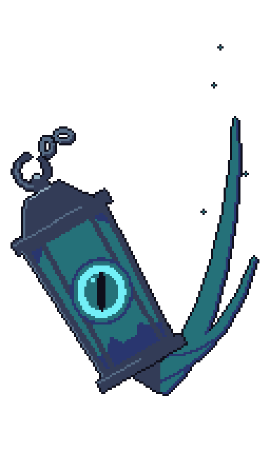 | 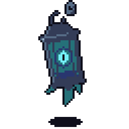 |

---

### Korvag — Gate-Breaker of the Iron Levy
**heavy · Ogre · Male · Gate-Breaker (armored anchor) · HP 160 · ATK 12 · slow move**

The Iron Levy takes one son from every ogre steading below the third dark, bolts a quarter-inch of dungeon-forged slab to him, and points him at whatever is currently a wall. Korvag has been pointed at eleven walls. Eleven walls have stopped existing. He is not cruel — between assaults he is placid, almost courtly, and he caps his tusks so as not to nick the armorers — but when the levy-brand on his chest heats up, everything in front of him becomes gate, and gates are for breaking.

On the board he is the math problem in the middle of the wave: too much HP to chip, too much ATK for a lone blocker to survive, too slow to rush the exit — the player must either stack focused fire while a defender tanks him or accept a broken line. His art states the contract plainly: slab steel says armored, gray-green mass says ogre-tough, the trudge says you have time, and the single coral brand-glow gives the eye a hot target dot on an otherwise cold mountain.

- **Identity kit:** bald granite brow, BROWN topknot stub, BRONZE #a3702b tusk-caps; gray-green hide (GRAY #6e7a94 into DEEP_GREEN #1a5f43, GREEN #38b764 edge highlights); SLATE #566c86 slab plates with STEEL #94b0c2 worn edges, DUSK #333c57 seams, BROWN leather cinches; signature prop: anvil-headed wrecking maul (DUSK/SLATE head, brown haft, bronze bands); accent: one CORAL #ef7d57 forge-brand rune on the chest slab.
- **Key art pose:** apex of an overhead charge-swing — maul hauled behind the head, back arched, forward leg cracking the flagstone, bellow showing bronze-capped tusks, plates lifting with the motion.
- **Iso sprite:** oversized heavy trudge (~1.7x grunt footprint, 3 heads), maul over shoulder, plates lag the step by a frame; at 64px the read is widest-silhouette slab mass + dark maul block + 2px coral brand.
- **gpt-image-2 prompt:**

```
Full-body dark fantasy anime key art of Korvag the iron-clad dungeon ogre, a huge slab-armored brute caught at the apex of a full overhead charge-swing: both massive hands hauling an anvil-sized wrecking maul (dark iron head #333c57 with slate #566c86 facets, tree-trunk brown #6b4a34 haft banded in bronze #a3702b) up behind his head, back arched, one enormous leg planted forward cracking the flagstone beneath it, bellowing. His hide is dull gray-green (gray #6e7a94 base shading into deep green #1a5f43, with muted #38b764 green only on highlight edges), bald granite brow, small brown topknot stub, jutting lower tusks capped in bronze #a3702b. He wears massive flat riveted slab-armor plates — slate #566c86 iron with worn steel #94b0c2 edges and dark #333c57 seams — strapped over the hide with heavy brown #6b4a34 leather cinches; the chest slab bears one burned-in glowing coral #ef7d57 forge-brand rune, his single hot accent. Plates lift and separate slightly with the swing, hide flexing beneath. Colossal weight and momentum, torch-shadow drama in near-black #0f0f1b, monstrous but readable gacha-anime proportions. dark fantasy anime key art, cel shading, dynamic action pose, full body, transparent background
```

| Key art | Iso battle sprite |
|---|---|
| 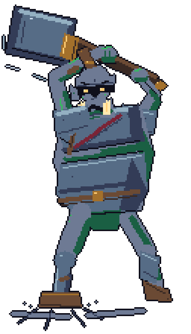 | 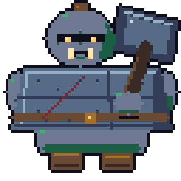 |

---

### The Warden — Death Knight of the Deep Halls
**mini_boss · Undead (death knight) · None · Warden (set-piece mini-boss) · HP 400 · ATK 16 · slow move · charm-immune**

When the deep halls were a kingdom, the Warden was its last oath: a knight-commander who swore the gates would hold, and then held them for two hundred years after everyone he held them for was dust. What walks the lanes now is the oath wearing the armor — no body inside, no name remembered, no mind left to charm — just duty inverted, marching outward through the gates it once defended. The ember behind the visor slit is not hatred; scholars of the Hollow Choir insist it is patience, which is worse.

He is the roster's set-piece: the wave-capping event every earlier enemy trains the player to survive. Runners taught tempo, Vesper taught priority, Korvag taught focus-fire — the Warden asks for all three at once, with 400 HP, blocker-killing swings, and immunity to the charm tools that trivialize lesser waves. His design language is the roster's grammar spoken at full volume: the coldest steel, the darkest voids, and the entire warm palette compressed into one horizontal ember slit that reads at any zoom, on any tile, as *the boss is looking at you*.

- **Identity kit:** no face — anvil-crowned great helm with a horizontal CORAL #ef7d57→GOLD #ffcd75 ember visor slit; fluted SLATE #566c86 full plate with STEEL #94b0c2 edge-light, DUSK #333c57 recesses, VOID #0f0f1b joints where a body isn't; tattered WINE #7a2436 floor-length cloak; signature prop: cathedral greatsword with CRIMSON #b13e53 ember-lit fuller, carried point-down; accent law: all warm pixels belong to the ember system.
- **Key art pose:** the lord's advance — unhurried stride at the viewer, greatsword dragged point-down carving a glowing crimson scratch and gold sparks, off-hand clenching, cloak tearing sideways, ember slit glaring up from under the lowered helm.
- **Iso sprite:** tallest lane silhouette (3 heads), slow ceremonial stride, dragged sword leaving a 1px crimson glow trail; at 64px the read is helm-block + 2px ember slit + steel edge-light + wine cloak wedge + trailing sword line.
- **gpt-image-2 prompt:**

```
Full-body dark fantasy anime key art of The Warden, a towering undead death knight of the deep halls, advancing directly toward the viewer in an unhurried, inevitable stride. Full fluted plate armor in cold steel tones — slate #566c86 plates, bright worn steel #94b0c2 edge-light, dark #333c57 recesses, and pure black-void #0f0f1b at every joint and beneath the helm where a body should show and does not. His smooth anvil-crowned great helm has a single horizontal visor slit burning from inside with coral #ef7d57 ember-glow flaring to gold #ffcd75 at its core, head lowered so the slit glares up from under the brow. He drags a cathedral greatsword nearly his own height point-down through the flagstones with one gauntlet — steel #94b0c2 blade with a crimson #b13e53 ember-lit fuller down its length, dark crossguard — carving a glowing crimson scratch and kicking up gold #ffcd75 sparks behind him; the off-hand gauntlet slowly clenches at his side. A tattered floor-length wine-red #7a2436 cloak shreds sideways in an unfelt wind, its ends fading to void-dark rags. All warm color strictly reserved for the ember system (visor slit, sword fuller, sparks); everything else cold steel and dead cloth. Overwhelming set-piece silhouette, boss-tier presence, torchlit dungeon gloom #0f0f1b. dark fantasy anime key art, cel shading, dynamic action pose, full body, transparent background
```

| Key art | Iso battle sprite |
|---|---|
| 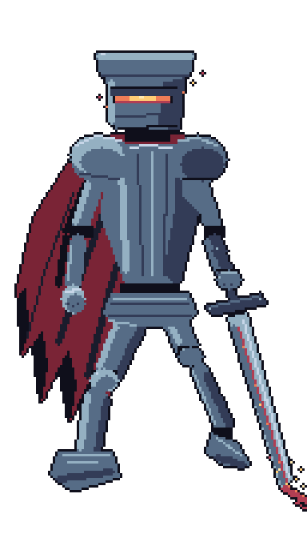 | 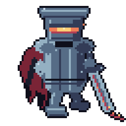 |


## 8. Production pipeline

1. **This proposal is the canon.** Once vetted, the reference set anchors every future asset: regeneration diffs against it, image-model passes prompt "in the exact style of this reference".
2. **Procedural lane (available today):** deterministic generator scripts in `tools/artgen/` — one per character, painting both representations through the shared `painter.py` (palette lint, hard alpha, canvas contract). Same-input ⇒ byte-identical output; provenance JSON per asset.
3. **Image-model lane (when access exists):** run each character's gpt-image-2 prompt block, then the standard normalization tax (background key → alpha threshold → palette quantize to TD32 for board sprites; key art may keep the model's full rendering). Board sprites still pass `painter.lint()`; key art passes human review against this canon.
4. **Human accept loop:** every asset ships `placeholder: true` until a human flips it. Machine gates decide *conformant*; only the human decides *final*.

## 9. Vet checklist

- [ ] Register: is "Torchlight & Steel" the right blend of D&D weight and gacha charm?
- [ ] The two-representation contract and its proportion pins
- [ ] Terrain doctrine — warm lane vs cool stone legibility law
- [ ] Each hero: identity kit, pose, name (ids stay stable; names are display-data)
- [ ] Each enemy: menace level and silhouette distinctness
- [ ] Palette law and the enemies-cold / heroes-warm temperature rule
- [ ] The reference art itself: which pieces pass as canon, which get re-rolled (procedurally or via image model later)

## 10. Appendix — how this reference set was generated

No image-model API was available, so the set was generated procedurally: one deterministic
painter script per character (`tools/artgen/gen_<id>.py`) over a shared library and style law,
authored and iterated by parallel agents (each ran 4–9 render-review cycles against its own
output), each piece gated by an adversarial judge, then two cross-set verify judges. Verify
flagged five cross-set issues (hero/enemy temperature reads, a vanguard identity collision,
silhouette legibility at 1×); a targeted fix pass addressed all five. Every asset carries a
provenance JSON; regeneration is `python3 tools/artgen/gen_<id>.py` — byte-identical output.

| id | name | judge verdict | render-review iterations |
|---|---|---|---|
| caster_1 | Maribel Cindervein | pilot · pass | 5 |
| vanguard_1 | Garrick Vael | pass → cross-set fix, re-verified | 8 |
| vanguard_2 | Juna Farrow | pass | 7 |
| guard_1 | Dagr Vosk | pass | 8 |
| guard_2 | Vessaryn Thal | pass → cross-set fix, re-verified | 7 |
| defender_1 | Odgar Hallanchor | pass | 7 |
| defender_2 | Sigrid Valebright | pass-after-fix | 8 |
| sniper_1 | Rennick Thorne | pass | 6 |
| sniper_2 | Liriel Vess | pass | 9 |
| caster_2 | Severin Thal | pass → cross-set fix, re-verified | 7 |
| runner | Snik | pass-after-fix → cross-set fix, re-verified | 11 |
| grunt | Gnarl | pass | 5 |
| spellcaster | Vesper | pass | 6 |
| drone | The Unblinking | pass | 7 |
| heavy | Korvag | pass → cross-set fix, re-verified | 10 |
| mini_boss | The Warden | pass | 4 |
| terrain | style plate | lint clean | 4 |

**Cross-set verify:** the consistency judge flagged guard_2 (hero read as villain), the two
vanguards (identity-kit collision), and heavy (grin + placeholder glyph); the board-quality
judge flagged guard_2, runner (1× silhouette collapse, warm palette), and caster_2 (illegible
prop, enemy-spellcaster silhouette twin). All five were fixed in a targeted pass and
re-verified with **zero remaining flags**. One human-review note survives: caster_2's iso
carries a small floating gray stone right of the staff arm — deliberate-looking, worth a glance.
