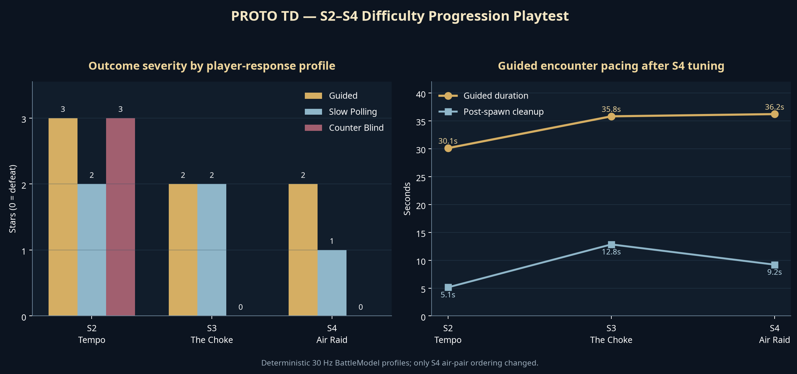

# S2–S4 Difficulty Progression Playtest

**Author:** Manus AI  
**Scope:** Act I stages S2–S4 after the early-enemy-variety release  
**Engine:** Godot 4.7.2 stable, deterministic 30 Hz `BattleModel`

## Executive Summary

The S2–S4 sequence was playtested with deterministic **guided**, **slow-polling**, and **counter-blind** player policies, then verified through native landscape and portrait battle captures. S2 and S3 already fulfilled their intended teaching roles and were left unchanged. S4 was marginally softer than S3 under the guided policy despite introducing a second combat domain, so its existing enemy composition and spawn times were preserved while the order of each aerial pair was changed: the durable **Interceptor now leads**, followed by a Drone.[1][2][3]

This small scheduling change produces a cleaner progression without adding enemies, increasing stats, moving wave boundaries, changing leak limits, or altering unlocks. The final guided outcomes are **S2: 3 stars**, **S3: 2 stars**, and **S4: 2 stars**. Delayed-response play degrades from **2 → 2 → 1 stars**, while counter-blind play remains recoverable in S2 but fails in S3 and S4. That is the desired pedagogical curve: learn the counter, demonstrate it under pressure, then execute it across separate ground and air lanes.

## Method

The permanent playtest harness attempts the authored recovery-roster queue from normal DP income at deterministic teaching cells until the battle reaches a terminal state, automatically triggers ready skills, and uses only traps unlocked before the stage.[4] S4 can therefore end with Defender still queued; the measured policy reflects what the economy actually permits rather than granting a full pre-deployment. Every stage/profile combination is executed twice, and the test requires byte-equivalent JSON projections between repetitions. This is not a substitute for human usability testing, but it is a stable regression instrument for comparing authored schedules without reaction-time noise.

| Profile | Response cadence | Counter behavior | Purpose |
|---|---:|---|---|
| **Guided** | Every 15 ticks (0.5 s) | Uses the intended S2 Caster, S3 three-block formation, and S4 Sniper; places available traps | Represents a player following the stage hint and deploying efficiently. |
| **Slow polling** | Evaluates actions every 60 ticks (2.0 s) | Uses the intended counter roster and traps | Tests whether a coarse decision cadence is survivable; actual deployment lag varies with DP eligibility. |
| **Counter-blind** | Evaluates actions every 15 ticks (0.5 s) | Omits the stage's intended operator/trap counter package | Confirms that the combined lesson package creates a meaningful efficiency or failure consequence. |

A second paired harness compares the live enemy-variety roster against its pre-variety counterpart under an intentionally permissive full-roster policy.[6][7] This isolates enemy-definition pressure from ordinary stage failure conditions. Native Xvfb captures exercise the guided policy in S2, S3, and S4 at 1280×720, plus S4 at 720×1280 after applying the production clockwise stage transform.

## Final Results

| Stage | Guided | Slow polling | Counter-blind | Guided duration | Guided cleanup after last spawn | Interpretation |
|---|---:|---:|---:|---:|---:|---|
| **S2 — Tempo** | 3 stars, 0 leaks | 2 stars, 1 leak | 3 stars, 0 leaks | 30.1 s | 5.1 s | A forgiving introduction. Ignoring the Caster lesson still clears, but takes 26.5% longer and inflicts 110.3% more operator damage. |
| **S3 — The Choke** | 2 stars, 1 leak | 2 stars, 1 leak | Defeat, 4 leaks | 35.8 s | 12.8 s | The first real formation check. Omitting the three-block answer is decisively punished. |
| **S4 — Air Raid** | 2 stars, 2 leaks | 1 star, 3 leaks | Defeat, 4 leaks | 36.2 s | 9.2 s | A fair two-domain execution test. A two-second decision-polling cadence costs a star without making the stage unwinnable. |

The guided duration rises monotonically from **30.1 s → 35.8 s → 36.2 s**. S3 deliberately has the longest cleanup tail because Breachers stress block capacity; S4 applies more immediate lane pressure and therefore resolves slightly faster after its final spawn. The star curve, not raw cleanup duration, is the primary progression signal because stars directly encode leaks and clear state in the current rule set.[8]

## Adjustment Decision

### S2: no change

S2 is functioning as a safe counter-introduction. Guided play clears perfectly, while slow polling causes one leak. Counter-blind play still clears, but its pressure integral rises from **1,799 to 3,061** (+70.1%), its duration rises from 30.1 to 38.1 seconds (+26.5%), and operator damage rises from 154 to 324 (+110.3%). This creates a visible reason to use Arts damage without turning the second level into a gate.

### S3: no change

S3 already supplies the campaign's first meaningful tactical failure boundary. Guided and slow-polling play both produce controlled two-star clears; removing the combined Defender and Spike Plate answer produces a defeat. The test does not claim either omission alone is fatal. In the paired enemy-variety comparison, Breachers add **42.9% pressure integral** and **14.7% resolution time** while reducing peak pressure by 7.5%, which is consistent with sustained block-capacity stress rather than an unfair burst spike.

### S4: reorder existing aerial pairs

Before tuning, the permanent guided policy cleared S4 perfectly at 3 stars with a pressure integral of only **1,897**, substantially below S3's **3,236**. The original schedule placed a Drone before the first Interceptor and ended the aerial sequence with an isolated Interceptor. This allowed the Sniper to erase the fragile lead target before the durable lesson arrived, then finish on a single target.

The final schedule keeps all eleven spawns and every tick unchanged but swaps the identities within both aerial pairs:

| Air sequence | Previous | Final |
|---|---|---|
| First pair | Drone at 510, Interceptor at 540 | **Interceptor at 510, Drone at 540** |
| Closing pair | Drone at 750, Interceptor at 810 | **Interceptor at 750, Drone at 810** |

The permanent playtest's embedded before-versus-after comparison records a final guided pressure integral of **2,362**, a measured 24.5% increase over the original order's 1,897.[4][5] The guided result moves from an overly soft 3-star perfect clear to the intended 2-star clear with two leaks; slow polling reaches one star, while omitting the Sniper-and-trap counter package still fails. In the separate permissive telemetry, the tuned S4 candidate remains a clear with three leaks and **996 of 999 base HP** remaining, +31.1% pressure integral, +5.8% peak pressure, and 1.2% shorter resolution time than the all-Drone baseline. This is stronger, but still bounded and recoverable.

## Visual Acceptance

The landscape captures show a coherent visual escalation from S2's compact armored lane, through S3's shared choke, to S4's separated ground and aerial routes. At the tuned S4 capture point, the Interceptor, Sniper response, ground blocker line, and trap state are simultaneously visible with no missing resources or runtime errors. The portrait harness rotates authored cells and facings through the same production transformation used by `StageDef`; it reaches the same tick-830 state with three enemies alive and zero leaks. All four capture logs are clean under Xvfb with Dummy audio.

## Recommendation

Ship the S4 pair-order adjustment and retain S2/S3 unchanged. The resulting curve is readable, counter-sensitive, and not stat-inflated. The next useful validation is a short human cohort playtest focused on **hint comprehension**, **first-attempt deployment order**, and whether players understand why S4's Interceptor should be engaged before its Drone escort. The deterministic harness should remain the CI guardrail for future enemy-stat, operator-cost, DP-regeneration, and stage-schedule changes.

## References

[1]: [S2 stage resource](../../data/stages/s2.tres)  
[2]: [S3 stage resource](../../data/stages/s3.tres)  
[3]: [S4 stage resource](../../data/stages/s4.tres)  
[4]: [Permanent S2–S4 playtest harness](../../tests/act1_s2_s4_balance_playtest_test.gd)  
[5]: [Final S2–S4 playtest JSON](act1-s2-s4-playtest-final.json)  
[6]: [Enemy-variety paired telemetry harness](../../tests/early_enemy_variety_balance_telemetry_test.gd)  
[7]: [Final paired telemetry JSON](../enemy-variants/BALANCE_TELEMETRY.json)  
[8]: [Star calculation authority](../../sim/star_calc.gd)
