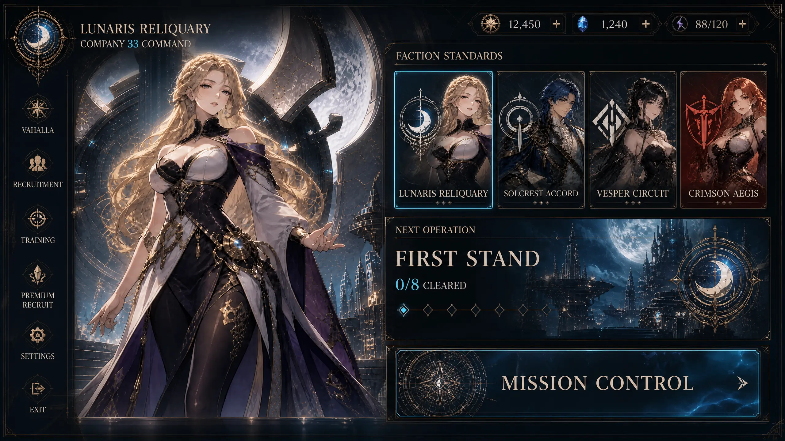
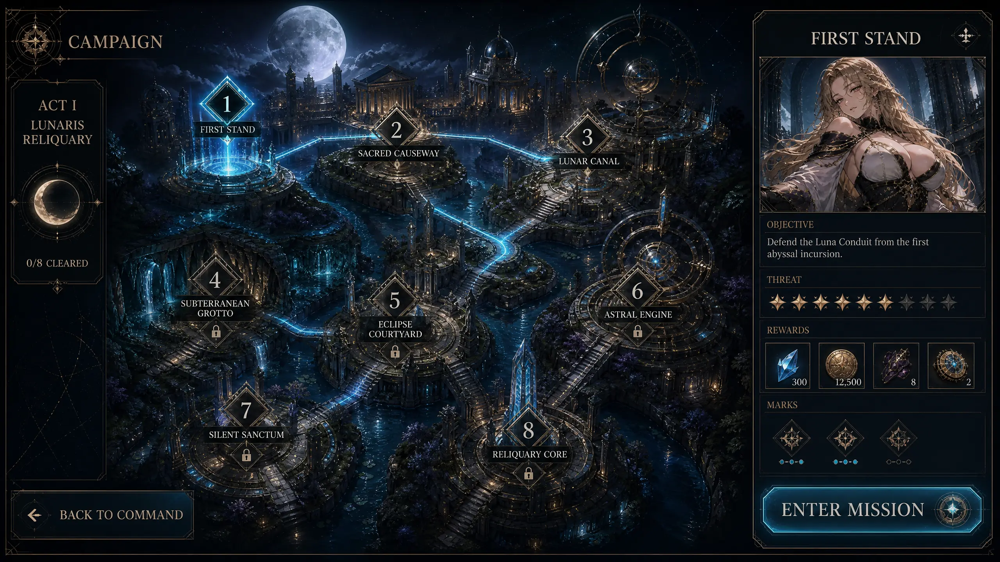
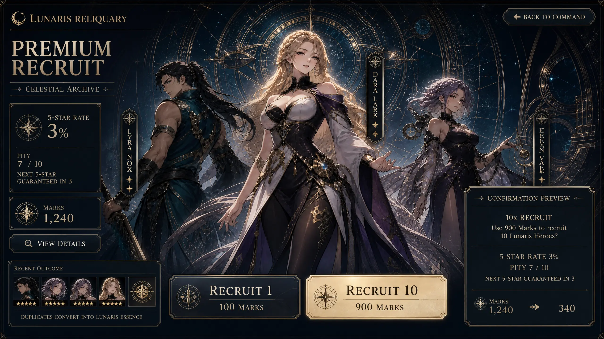
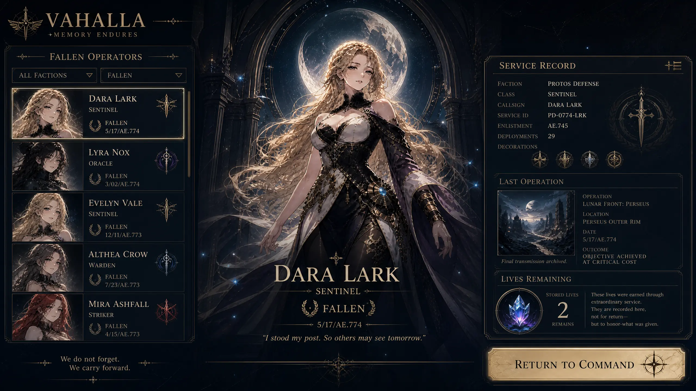
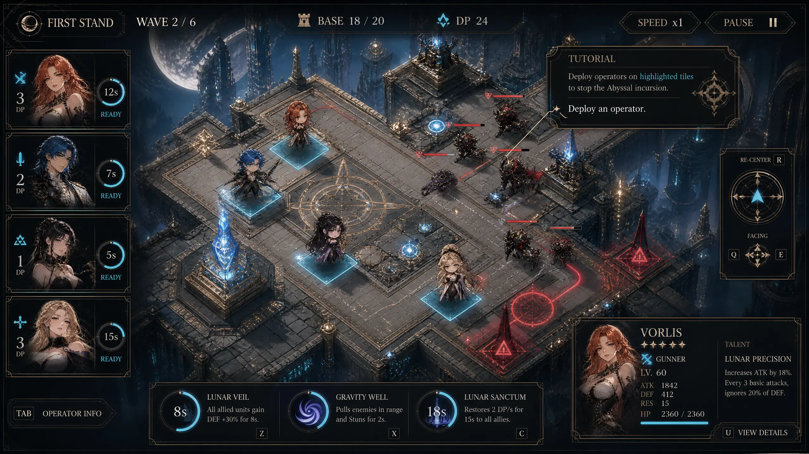
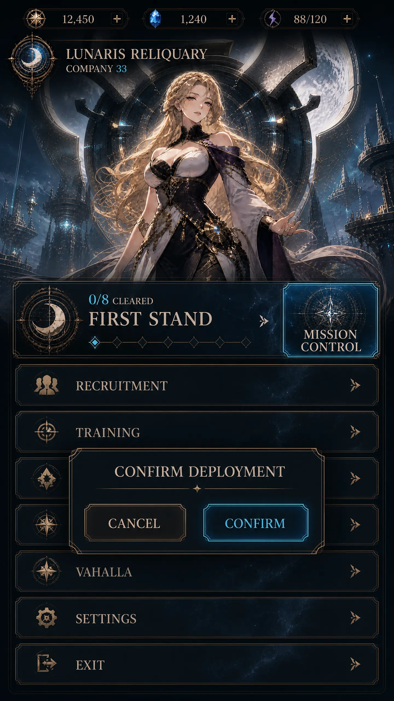
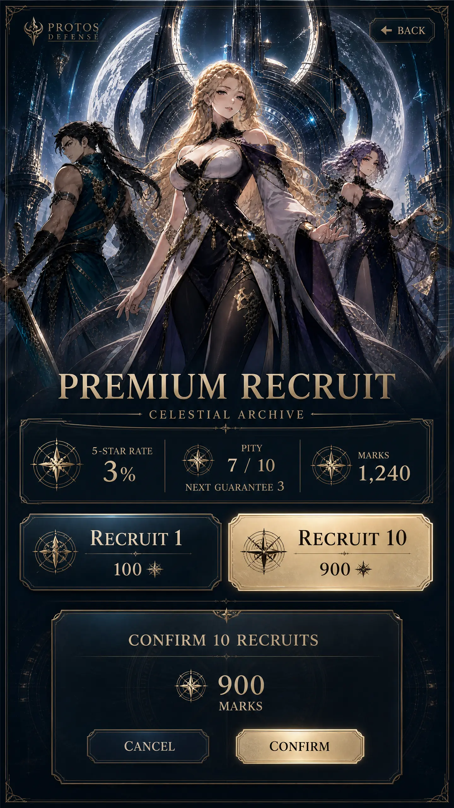
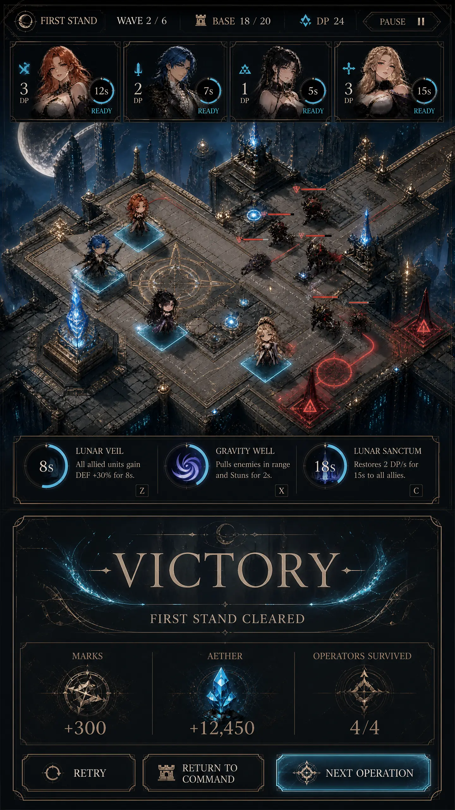

# Protos Unified Interface Concept

**Author:** Manus AI  
**Target:** Godot 4.7.2  
**Scope:** Every game UI and dialog outside the accepted loading/title experience

## Design objective

The interface will be rebuilt as a single **Lunaris Astral Command System**: a premium, character-forward tactical console whose visual authority matches the existing loading and title screens. Every depicted hero remains clearly adult, age 21 or older, glamorous, powerful, and non-explicit. The redesign does not replace simulation, campaign, economy, roster, persistence, navigation, localization, or accessibility behavior. It changes how those systems are projected to the player.

> Character art supplies emotional and gacha appeal; native Godot controls supply authoritative information, interaction, localization, and state.

The system rejects generic utility dialogs, centered retro plates, anonymous rounded cards, and empty margins. Screens use asymmetric editorial compositions, clipped architectural frames, near-black lunar glass, engraved antique-gold structure, ivory typography, and moon-cyan energy only for focus, selection, readiness, and primary action.

## Visual grammar

| Layer | Production rule |
|---|---|
| **Hero stage** | Use canonical adult character references as cinematic anchors. Never cover faces, weapons, or essential silhouette with UI copy. |
| **Command glass** | Near-black navy surfaces remain 88–96% opaque behind text. Panels use one-to-six-pixel clipped corners rather than rounded consumer-app cards. |
| **Reliquary structure** | Thin antique-gold rules, orbital marks, pointed joints, and engraved divisions establish hierarchy without ornamental overload. |
| **State energy** | Moon-cyan communicates focus, selection, readiness, unlocked routes, and primary actions. Muted red is reserved for active danger, invalid placement, defeat, or irreversible loss. |
| **Typography** | Cinzel remains the Latin display face for screen identity and major actions; the existing Protos/Noto family remains the body and CJK-safe face. Labels are rendered natively. |
| **Depth** | Translucent glass, localized shadows, restrained bloom, and layered backdrops create premium depth. UI must remain readable over every animated or battle frame. |
| **Motion** | Focus uses the existing restrained fill pulse. Dialogs enter with short opacity/translation transitions; reduced-motion mode uses immediate state changes. |

## Desktop visual targets

### Company Command

Company Command becomes the global navigation archetype. Landscape keeps the adult Lunaris commander in a large left hero stage while faction standards, next-operation data, campaign progress, and the primary Mission Control action occupy a dense right command deck. Secondary destinations move to a slim persistent operation rail or an equivalent responsive tile list. Live availability and disabled states remain authoritative.

### Campaign map

The authored campaign map receives full visual priority. A compact chapter rail communicates act identity and completion; the selected operation opens a full-height dossier containing title, objective, threat, rewards, Marks, and the entry action. Selected, connected, completed, and locked nodes must remain distinguishable without relying on color alone.

### Premium Recruit

Premium Recruit uses the canonical launch trio as a true banner composition. Pity, odds, Marks, guarantee distance, recent outcome, duplicate-life behavior, and pull actions remain simultaneously visible. Confirmation is an explicit command sheet containing cost, current balance, post-action balance, and guarantee context. No element implies a real-money purchase.

### Vahalla

Vahalla becomes a dignified memorial archive rather than a roster table. The selected fallen identity receives a large portrait and service epitaph; filters and the fallen list remain on the left, while the right ledger communicates faction, class, service record, last operation, and premium-life context. Stored lives do not imply resurrection of a fallen instance.

### Battle HUD

The battlefield remains dominant. Battle authority is divided among a compact top metrics bar, an operator deployment rail, a bottom spell dock, and contextual edge overlays for tutorial, navigation, facing, selection, and placement feedback. Secondary dossier detail is collapsible. Controls may move at breakpoints, but their behavior and current state must not disappear.

## Portrait visual targets

### Command sheets and dialogs

Portrait uses a cinematic upper hero stage and a bottom-attached, locally scrollable command sheet. Modal dialogs use the same clipped frame grammar, bounded scrim, native copy, touch-safe controls, focus trapping, and deterministic return focus. Background controls become inert while a dialog is active.

### Premium Recruit

The banner remains the emotional focus while rates, pity, guarantee, Marks, and both pull actions remain in the first view. Pull confirmation attaches to the bottom safe area without hiding balance or pity information.

### Battle and results

Portrait battle moves the operator rail to a horizontal strip and retains a fixed spell dock. Results use a separate bottom-attached state with real rewards and all continuation actions visible. The concept presents both states together only to document shared geometry; production displays exactly one authoritative state at a time.

## Shared component model

| Component | Responsibility | Required states |
|---|---|---|
| `AstralScreenShell` | Safe-area layout, screen header, background, local scroll region, action dock | Landscape, compact landscape, portrait, CJK |
| `AstralPanel` | Reusable glass and engraved panel surface | Standard, quiet, emphasized, danger, memorial |
| `AstralButton` | Native action control with typography and ornament | Normal, hover, focus, pressed, disabled, primary, danger |
| `AstralDialog` | Modal/sheet container with focus trapping and return-focus contract | Confirmation, detail, warning, success, defeat |
| `OperatorCard` | Adult portrait, identity, role, readiness, cost/lives/status | Default, selected, ready, locked, fallen, premium |
| `MetricChip` | Compact authoritative resource or battle value | Normal, warning, critical, capped |
| `SectionHeader` | Screen and subsection hierarchy | Display, heading, eyebrow, metric |
| `ActionDock` | Persistent major actions | One, two, or three actions; portrait stack |
| `StateSigil` | Selection, lock, progress, warning, rarity, memory | Semantic icon plus text; never color-only |

## Responsive contract

| Viewport | Layout contract |
|---|---|
| **1280×720 and wider** | Asymmetric two- or three-column compositions; hero art may occupy 38–48% of the width; action docks remain visible without page-level scrolling. |
| **800–1279 px landscape** | Decorative labels collapse first; functional metrics and actions remain. Secondary dossier columns may become tabs or drawers. |
| **720×1280 portrait** | Hero/map stage occupies the upper region; actionable content attaches below. Operator rails become horizontal. Dialogs and results become bottom sheets. |
| **540×960 narrow portrait** | Minimum 44-pixel targets, compact metrics, local scrolling only, no horizontal overflow, and all primary actions within the safe area. |

## Feature-preservation doctrine

The redesign must never invent state. Campaign unlocks, mission facts, squad capacity, roster status, training eligibility, promotion permanence, custom names, gacha rates, pity, Marks costs, premium lives, death state, battle metrics, tutorial steps, placement validity, pause behavior, rewards, retry, and navigation all continue to derive from their existing models and presenters. Generated mockup names, values, scenery, and character variants are visual placeholders only. Existing localization keys and controller/keyboard routes remain valid or receive explicit migrations with regression coverage.

## Acceptance standard

A screen passes only when it presents the same functional state as before, visibly belongs to the title screen’s adult premium anime-gacha world, remains readable at landscape and portrait breakpoints, preserves input focus and touch behavior, and introduces no script, resource, renderer, network, or browser-console errors. The implementation plan is the execution authority and must be updated after each completed phase.
