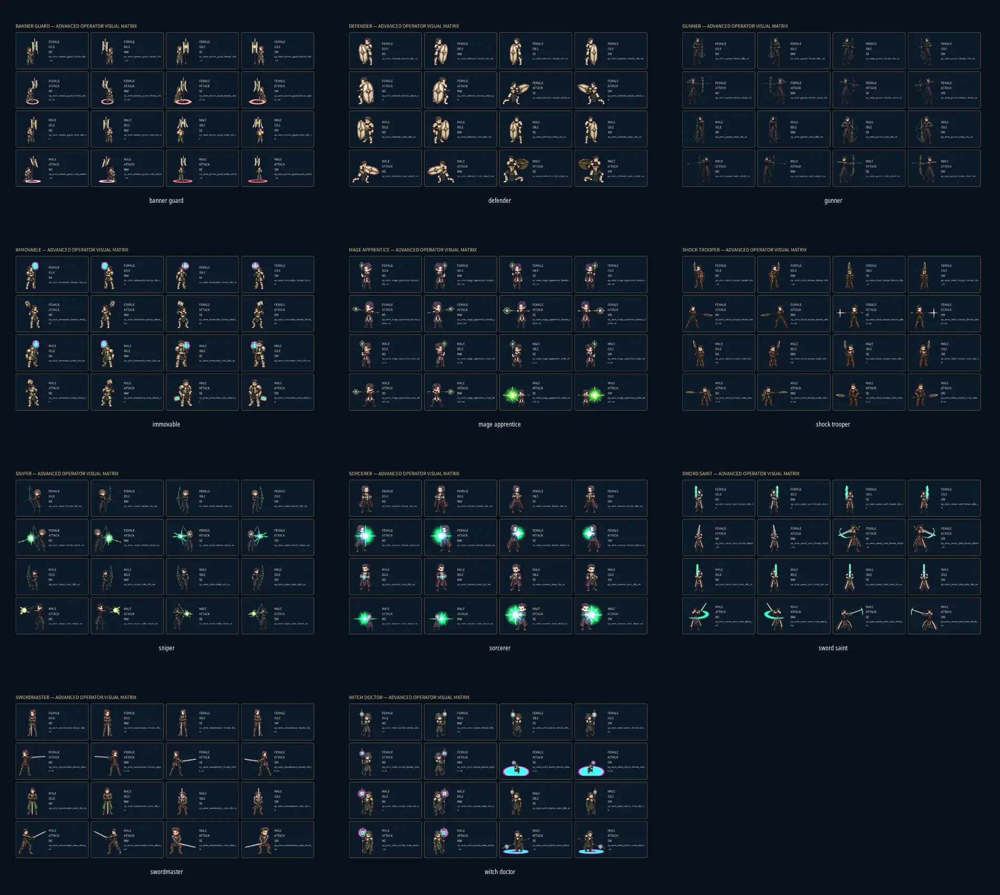
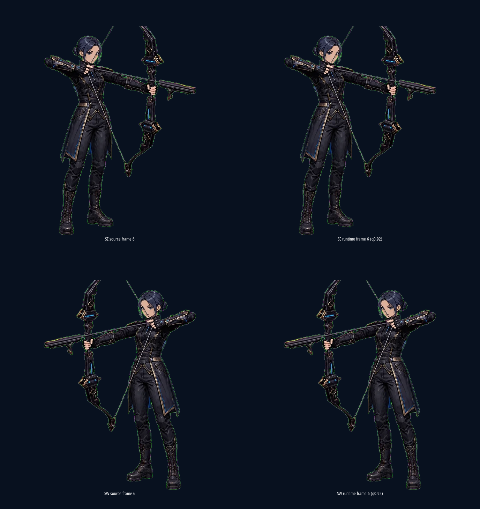

# Advanced Operator Compression and Live-Combat Quality Review

**Author:** Manus AI

**Date:** 2026-08-28

**Engine:** Godot 4.7.2 stable (`ed1daf0bf`)

## Conclusion

The quality-0.92 Godot import profile is **approved for all eleven advanced operator classes**. All 176 runtime atlases preserve exact alpha, pass a conservative decoded-texture fidelity proxy, and remain visually clean in production BattleView rendering across landscape and portrait layouts. Eleven independent class reviews found no compression-induced blocking, ringing, banding, smear, alpha fringe, silhouette loss, or state-readability defect.[1] [2]

## Audit scope and method

The review covered **176 atlases**: eleven classes, two genders, two actions, and four isometric facings. Every idle atlas is **5120×1920** and every attack atlas is **5120×1280**, with 640×640 source cells and eight columns. The test asserts this geometry before measurement.[2]

The quantitative guard is a **conservative 320px decoded-texture proxy**, not a literal BattleView-rendering measurement. It compares each source WebP against Godot's imported `Texture2D`, downsamples both to 320px cells, composites visible pixels over dark and light terrain proxies, and measures PSNR, RGB mean absolute error, alpha drift, and edge-energy retention. The default repository gate checks one representative case per class in approximately twenty seconds; the explicit full mode checks all 176 atlases in a bounded run.[2]

Visual acceptance uses **77 Xvfb captures**: eleven complete 16-state close-up matrices and sixty-six production BattleView frames. Each class has landscape idle/attack frames containing both genders across all four facings, plus separate female and male portrait idle/attack frames containing all four facings. The harness routes every fixture through `scenes/battle.tscn`, `BattleView._project_units()`, the production visual catalog, and `OperatorAnimator`. It asserts the expected template, direction, logical atlas, animation frame, and state before saving each image.[3]

| Acceptance criterion | Required | Observed | Result |
|---|---:|---:|---:|
| Atlas coverage | 176 | 176 | Pass |
| Idle geometry | 5120×1920 | 88/88 exact | Pass |
| Attack geometry | 5120×1280 | 88/88 exact | Pass |
| Minimum 320px-proxy PSNR | 30.0 dB | 36.457 dB | Pass |
| Maximum 320px-proxy RGB MAE | 0.017 | 0.007928 | Pass |
| Maximum alpha MAE | 0.002 | 0.000000 | Pass |
| Edge-energy ratio | 0.90–1.10 | 0.9749–1.0048 | Pass |
| Complete close-up matrices | 11 | 11 | Pass |
| Production BattleView frames | 66 | 66 | Pass |
| Independently approved classes | 11 | 11 | Pass |
| Classes requiring higher import quality | 0 | 0 | Pass |

## Per-class quantitative results

| Class | Atlases | Minimum PSNR | Maximum RGB MAE | Alpha MAE | Edge ratio range | Visual verdict |
|---|---:|---:|---:|---:|---:|---|
| Banner Guard | 16 | 36.457 | 0.007474 | 0.000000 | 0.9871–1.0017 | Pass |
| Defender | 16 | 41.011 | 0.004660 | 0.000000 | 0.9959–1.0004 | Pass |
| Gunner | 16 | 37.122 | 0.007228 | 0.000000 | 0.9749–0.9880 | Pass |
| Immovable | 16 | 39.971 | 0.005485 | 0.000000 | 0.9954–0.9997 | Pass |
| Mage Apprentice | 16 | 36.988 | 0.007064 | 0.000000 | 0.9900–0.9967 | Pass |
| Shock Trooper | 16 | 37.822 | 0.007001 | 0.000000 | 0.9944–1.0048 | Pass |
| Sniper | 16 | 36.888 | 0.007928 | 0.000000 | 0.9834–1.0008 | Pass |
| Sorcerer | 16 | 40.409 | 0.005025 | 0.000000 | 0.9885–0.9975 | Pass |
| Sword Saint | 16 | 37.517 | 0.006558 | 0.000000 | 0.9904–0.9955 | Pass |
| Swordmaster | 16 | 37.366 | 0.007062 | 0.000000 | 0.9859–1.0013 | Pass |
| Witch Doctor | 16 | 38.989 | 0.005721 | 0.000000 | 0.9956–1.0018 | Pass |

The full per-atlas measurements are preserved in [`compression-metrics.json`](compression-metrics.json), and the condensed class table is available as [`compression-by-class.tsv`](compression-by-class.tsv).[2]

## Gunner adjudication

Gunner received an additional source-versus-runtime review because its authored green and magenta contour pixels could be mistaken for compression fringes. The paired comparison proves that those pixels already exist in the source WebP around the face, coat, bow, string, and boots; the quality-0.92 import does not introduce them.[4]

A quality-1.0 probe produced no perceptible improvement. For the representative female SE attack atlas, the imported CTEX grew from **1,337,132 bytes** at quality 0.92 to **2,971,748 bytes** at quality 1.0—approximately **122% larger**—while source/runtime close-up and production-scale comparisons remained visually indistinguishable. The current profile is therefore the correct quality-to-size tradeoff.

## Release safeguards

The repository now contains a reusable all-class BattleView capture harness, an exact-routing validator, and a compression-quality regression. The default metric gate remains fast enough for the normal full repository suite, while `ADVANCED_COMPRESSION_FULL=1` and the matrix runner perform the complete 176-atlas audit. Future import changes that damage alpha, blur or oversharpen edges, break atlas geometry, misroute class/gender/facing/state, or exceed the accepted error envelope will fail deterministically.[2] [3]

No gameplay, animation timing, source art, or runtime display footprint was changed. The 640px source cells and quality-0.92 runtime profile remain intact.

## Release validation

The final reconciled source passed direct Godot 4.7.2 import, bounded headless boot, all **79 current repository tests and smokes**, and the strict parse/runtime/resource error scan. The fast representative compression sentinel completed within the normal per-test budget; the explicit 176-atlas audit and all 77 Xvfb captures completed separately with zero failures.

## References

[1]: ./all-classes-closeup-contact.webp "Advanced operator close-up contact sheet"
[2]: ./compression-metrics.json "Complete 176-atlas compression metrics"
[3]: ./live/defender-portrait-female-attack.webp "Representative production BattleView portrait capture"
[4]: ./gunner-source-runtime-closeup.png "Gunner source-versus-runtime compression adjudication"
